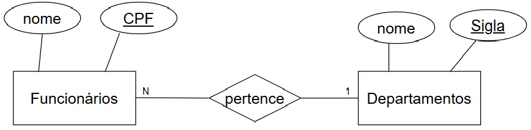

# Modelagem de Bancos de Dados

#### 18/08/2025 {.unnumbered}

#### Professor Miguél Suares {.unnumbered}

## Introdução: Visitando a teoria de Bancos de Dados

{width="452"}

> **Banco de Dados** Um banco de dados é uma coleção compartilhada de dados logicamente relacionados, projetada para atender às necessidades informacionais de uma organização. - *DATE, C. J. An Introduction to Database Systems. 8. ed. Boston: Addison-Wesley, 2003*.

Ou seja, alguns pontos-chave da definição de Date:

-   "Coleção de dados ..." → não é um conjunto de arquivos soltos, mas dados organizados.

-   "Compartilhada ..." → não pertence a apenas um usuário ou aplicação; é usada por vários.

-   "Dados logicamente relacionados ..." → os dados têm um relacionamento semântico, não são apenas agrupamentos arbitrários.

-   "Projetada para atender necessidades ..." → o banco existe para suportar os processos de uma organização (consultas, relatórios, controle, tomada de decisão).


> **Banco de Dados Relacional** Um banco de dados relacional é um banco de dados baseado em um modelo de dados relacional, no qual os dados são representados como um conjunto de relações (tabelas), e cada relação consiste em tuplas (linhas) e atributos (colunas). - *SILBERSCHATZ, Abraham; KORTH, Henry F.; SUDARSHAN, S. Database System Concepts. 6. ed. New York: McGraw-Hill, 2010.*

Agora, alguns pontos-chave da definição de *Abraham Silberschatz* :

-   Base no modelo relacional de Codd (1970).

-   Dados representados em tabelas (relações).

-   Cada tabela é composta de tuplas (linhas) e atributos (colunas).

-   Integridade garantida por restrições (chaves, integridade referencial, domínio de atributos).

-   Manipulação feita por linguagens relacionais (álgebra relacional, cálculo relacional, SQL).

O Banco de Dados Relacional organiza as informações em **tabelas bidiomensionais** constituídas de **linhas e colunas** chamadas e essas tabelas recebem o nome de **relações**. Cada **relação** possui um **campo-chave** que confere identificação exclusiva a cada registro da tabela.

## Modelo Matemático de um Banco de Dados

Considere um Banco de Dados para representar, com consistência Matemática os
funcionários e Departamentos de uma Empresa. 

### Podemos representa-lo matemáticamente utilizando a teoria dos conjuntos


```{r tikz-diagrama0, engine='tikz', echo=FALSE, fig.cap="Diagrama de Montadoras, Veículos e Proprietários"}
\usetikzlibrary{arrows,positioning,shapes,fit,calc}

\pgfdeclarelayer{background}
\pgfsetlayers{background,main}

\begin{tikzpicture}
[
  every node/.style={on grid},
  setA/.style={fill=blue ,circle,inner  sep=3pt},
  setB/.style={fill=green,circle,inner  sep=3pt},
  setC/.style={fill=red,rectangle,inner sep=3pt},
  every fit/.style={draw,fill=blue!25,ellipse,text width=25pt},
  >=latex
]

% Conjunto Montadoras
\node [setA,              label  = left:$Fulano$]  (a) {};
\node [setA,below = of a, label  = left:$Beltrano$]  (b) {};
\node [setA,below = of b, label  = left:$Ciclano$] (c) {};
\node [above      = of a, anchor = south] {$Funcionarios$};

% Conjunto Veiculos
\node[setB,inner sep=0pt,right  = 4 cm of a] (x) {$RH$};
\node[setB,below                =    of x] (y) {$Financas$};
\node[setB,inner sep=0pt,below  =    of y] (z) {$Diretoria$};
\node[above      = of x, anchor = south] {$Departamentos$};


% the arrows
%\draw[->,shorten >= 3pt] (a) -- node[label=above:$f(Corsa)$]  {} (x);
%\draw[->,shorten >= 3pt] (b) -- node[label=above:$g(Fiesta)$] {} (y);
%\draw[->,shorten >= 3pt] (c) -- node[label=above:$h(Gol)$]    {} (z);
%\draw[->,shorten <= 3pt] (x) -- node[label=above:$i(Fulano)$] {} (m);
%\draw[->,shorten <= 3pt] (y) -- node[label=above:$j(Beltrano)$] {} (n);
%\draw[->,shorten <= 3pt] (z) -- node[label=above:$k(Ciclano)$] {} (p);

%\draw[->] (n) -- node[label=above:$j(j(Beltrano))$] {} (y);

% the boxes around the sets
\begin{pgfonlayer}{background}
\node[fit= (a)  (c) ] {};
\node[fit= (x) (z)  ] {};
%\node[fit= (m) (p)  ] {};
\end{pgfonlayer}
\end{tikzpicture}

```


#### Edgard F Cood explica em sua obra "A Relational Model of Data for Large Shared Data Banks" como definir uma Banco de Dados compartilhado *matemáticamente*

> Um banco de dados relacional é um banco de dados no qual todos os dados são representados por meio de relações (matematicamente, conjuntos de tuplas), e todas as operações sobre os dados são baseadas em operadores formais do cálculo relacional e da álgebra relacional. - *A Relational Model of Data for Large Shared Data Banks” (Communications of the ACM, vol. 13, n. 6, pp. 377–387, 1970).*


### Então para podemos relacionar estes dois conjuntos (Funcionários e Departamentos) utilizando a Teoria das Funções


$$

f(x) = Y 

$$

$$

F(Funcionário) = Departamento

$$


```{r tikz-diagrama10, engine='tikz', echo=FALSE, fig.cap="Diagrama de Montadoras, Veículos e Proprietários"}
\usetikzlibrary{arrows,positioning,shapes,fit,calc}

\pgfdeclarelayer{background}
\pgfsetlayers{background,main}

\begin{tikzpicture}
[
  every node/.style={on grid},
  setA/.style={fill=blue ,circle,inner  sep=3pt},
  setB/.style={fill=green,circle,inner  sep=3pt},
  setC/.style={fill=red,rectangle,inner sep=3pt},
  every fit/.style={draw,fill=blue!25,ellipse,text width=25pt},
  >=latex
]

% Conjunto Montadoras
\node [setA,              label  = left:$Fulano$]  (a) {};
\node [setA,below = of a, label  = left:$Beltrano$]  (b) {};
\node [setA,below = of b, label  = left:$Ciclano$] (c) {};
\node [above      = of a, anchor = south] {$Funcionarios$};

% Conjunto Veiculos
\node[setB,inner sep=0pt,right  = 4 cm of a] (x) {$RH$};
\node[setB,below                =    of x] (y) {$Financas$};
\node[setB,inner sep=0pt,below  =    of y] (z) {$Diretoria$};
\node[above      = of x, anchor = south] {$Departamentos$};


% the arrows
\draw[->,shorten >= 3pt] (a) -- node[label=above:$f(Trabalha)$]  {} (x);
\draw[->,shorten >= 3pt] (b) -- node[label=above:$g(Trabalha)$] {} (y);
\draw[->,shorten >= 3pt] (c) -- node[label=above:$h(Trabalha)$]    {} (z);
%\draw[->,shorten <= 3pt] (x) -- node[label=above:$i(Fulano)$] {} (m);
%\draw[->,shorten <= 3pt] (y) -- node[label=above:$j(Beltrano)$] {} (n);
%\draw[->,shorten <= 3pt] (z) -- node[label=above:$k(Ciclano)$] {} (p);

%\draw[->] (n) -- node[label=above:$j(j(Beltrano))$] {} (y);

% the boxes around the sets
\begin{pgfonlayer}{background}
\node[fit= (a)  (c) ] {};
\node[fit= (x) (z)  ] {};
%\node[fit= (m) (p)  ] {};
\end{pgfonlayer}
\end{tikzpicture}

```


Mas vai ficar faltando como representar os atributos nesse modelo (colunas das tabelas):

Ainda, é necessário acrescentar algumas regras de integridade a representação;


## Modelo Lógico de Banco de Dados

### Modelo Conceitual "Entidade Relacionamento" de Banco de Dados

O Modelo Entidade-Relacionamento (MER), proposto por Peter Chen em 1976, é uma ferramenta fundamental na modelagem de dados. É um modelo de dados de alto nível que descreve a estrutura conceitual de um banco de dados. O Modelo Entidade-Relacionamento (MER) é representado graficamente através de um DER (Diagrama Entidade-Relacionamento).

É utilizado para projetar Bancos de Dados Relacionais a partir de entrevistas onde se descreve as informações que se deseja armazenar de forma consistente. Exemplo:

"*Desenhe um diagrama entidade-relacionamento DER contendo as entidades funcionarios e departamentos. A entidade "funcionários" possui os atributos "nome" e "CPF". A entidade "Departamentos" possui os atributos "Nome" e "sigla". O atributo "CPF" é chave primária da entidade "Funcionários". O atributo "sigla" é chave primária da entidade "Departamentos". As entidades "Funcionários" e "Departamentos" se relacionam através de um relacionamento chamado "Pertence"*."



Segundo Laudon

> **Diagrama Entidade/Relacionamento (DER)** é uma representação esquemática utilizada para entender as relações entre as tabelas de um banco de dados relacional. [[1] - LAUDON, Kenneth C.; LAUDON, Jane P. \*Sistemas de informação gerenciais\*. 11. ed. São Paulo: Pearson Education do Brasil, 2010. p. 180.]

### Composição e Significado do Diagrama Entidade Relacionamento (DER)

+:------------:+:---------------------------------:+:--------------------------------------:+
| **Nome**     | **Desenho**                       | **Significado**                        |
+--------------+-----------------------------------+----------------------------------------+
| Entidade     |  | Representa uma tabela e é identificada |
|              |                                   |                                        |
|              |                                   | no texto por um **substantivo**.       |
+--------------+-----------------------------------+----------------------------------------+

+:-----------:+:-------------------------------------------:+:--------------------------------------------------------------------:+
| **Nome**    | **Desenho**                                 | **Significado**                                                      |
+-------------+---------------------------------------------+----------------------------------------------------------------------+
| Atributo    | {width="182"} | Representa uma coluna e é identificada no texto por um **adjetivo**. |
+-------------+---------------------------------------------+----------------------------------------------------------------------+

+:--------------:+:--------------------------------------------:+:----------------------------------------------:+
| **Nome**       | **Desenho**                                  | **Significado**                                |
+----------------+----------------------------------------------+------------------------------------------------+
| Relacionamento | {width="185"} | Representa uma **Referência** e é identificada |
|                |                                              |                                                |
|                |                                              | no texto por um **Verbo**.                     |
+----------------+----------------------------------------------+------------------------------------------------+

## Modelo Físico de Banco de Dados

### Geração do modelo Físico para aplica-lo ao SGBD (Sistema de Gerenciamento de Banco de Dados):

Uma vez que o modelo conceitual seja gerado, o analista pode mapea-lo para um "modelo físico" onde se mapeiam chaves primárias e chaves forasteiras nas tabelas.

Após a geração do modelo físico pode-se gerar o SQL que monta a estrutura do Banco de Dados.


### Código SQL - Implementação do Modelo Físico

``` sql
-- Exemplo testado e gerado no SGBD Postgres versão 15

-- Tabela Funcionários
CREATE TABLE IF NOT EXISTS "public".funcionarios
(
    cpf bigint NOT NULL,
    nome varchar(200)
);

-- Tabela Departamentos

CREATE TABLE IF NOT EXISTS "public".departamentos
(
    sigla integer NOT NULL,
    nome varchar(200)
);

-- Definindo a coluna "cpf" da tabela "funcionários" como chave primária
alter table "public".funcionarios add constraint "chave_primaria_funcionarios" primary key (cpf);

-- Definindo a coluna "sigla"" da tabela "departamentos" como chave primária
alter table "public".departamentos add constraint "chave_primaria_departamentos" primary key (sigla);

-- Gerando a integridade referêncial 
-- Importando a chave primária da tabela "departamentos" como "chave estrangeira"
-- na tabela "funcionários"

-- primeiro adiciona-se a coluna estrageira "sigla" que é coluna originalmente 
-- pertencente a tabela departamentos
alter table "public".funcionarios add column sigla integer;

-- finalmente conecte a coluna sigla a chave primária da tabela "departamento"
-- criando então uma chave estrageira na tabela "funcionários".
alter table "public".funcionarios add constraint "Chave_estrangeira_Departamento_funcionarios" foreign key (sigla) references "public".departamentos(sigla);
```

## EXEMPLO: MONTADORA

### Modelo Matemático

Construa um Banco de Dados com suporte a consistência das informações. Utilize para isso o modelo Relacional. Precisamos armazenar as informações dos Veículos, Montadoras e Proprietários;

#### Representação Matemática em Conjuntos e seus Elementos :

```{r tikz-diagrama1, engine='tikz', echo=FALSE, fig.cap="Diagrama de Montadoras, Veículos e Proprietários"}
\usetikzlibrary{arrows,positioning,shapes,fit,calc}

\pgfdeclarelayer{background}
\pgfsetlayers{background,main}

\begin{tikzpicture}
[
  every node/.style={on grid},
  setA/.style={fill=blue ,circle,inner  sep=3pt},
  setB/.style={fill=green,circle,inner  sep=3pt},
  setC/.style={fill=red,rectangle,inner sep=3pt},
  every fit/.style={draw,fill=blue!25,ellipse,text width=25pt},
  >=latex
]

% Conjunto Montadoras
\node [setA,              label  = left:$Chevrolet$]  (a) {};
\node [setA,below = of a, label  = left:$Ford$]       (b) {};
\node [setA,below = of b, label  = left:$VolksWagen$] (c) {};
\node [above      = of a, anchor = south] {$Montadoras$};

% Conjunto Veiculos
\node[setB,inner sep=0pt,right  = 4 cm of a] (x) {$Corsa$};
\node[setB,below                =    of x] (y) {$Fiesta$};
\node[setB,inner sep=0pt,below  =    of y] (z) {$Gol$};
\node[above      = of x, anchor = south] {$Veiculos$};

% Conjunto Proprietarios
\node[setC,label=right:$Fulano$,right   = 4 cm of x] (m) {};
\node[setC,label=right:$Beltrano$,below =     of m] (n) {};
\node[setC,label=right:$Ciclano$,below  =     of n] (p) {};
\node[above=of m,anchor=south] {$Proprietarios$};


% the boxes around the sets
\begin{pgfonlayer}{background}
\node[fit= (a)  (c) ] {};
\node[fit= (x) (z)  ] {};
\node[fit= (m) (p)  ] {};
\end{pgfonlayer}
\end{tikzpicture}

```

#### Gerando os Relacionamentos "Matemáticamente" - (Teoria das Funções, Domínios e Imagens):

```{r tikz-diagrama2, engine='tikz', echo=FALSE, fig.cap="Diagrama de Montadoras, Veículos e Proprietários"}
\usetikzlibrary{arrows,positioning,shapes,fit,calc}
\pgfdeclarelayer{background}
\pgfsetlayers{background,main}

\begin{tikzpicture}[
  every node/.style={on grid},
  setA/.style={fill=blue ,circle,inner sep=3pt},
  setB/.style={fill=green,circle,inner sep=3pt},
  setC/.style={fill=red,rectangle,inner sep=3pt},
  every fit/.style={draw,fill=blue!25,ellipse,text width=25pt},
  >=latex
]

\node [setA,              label=left:$Chevrolet$]  (a) {};
\node [setA,below = of a, label=left:$Ford$]       (b) {};
\node [setA,below = of b, label=left:$VolksWagen$] (c) {};
\node [above=of a,anchor=south] {$Montadoras$};

\node[setB,inner sep=0pt,right=3cm of a] (x) {$Corsa$};
\node[setB,below=of x] (y) {$Fiesta$};
\node[setB,inner sep=0pt,below=of y] (z) {$Gol$};
\node[above=of x,anchor=south] {$Veiculos$};

\node[setC,label=right:$Fulano$,right=3cm of x] (m) {};
\node[setC,label=right:$Beltrano$,below=of m] (n) {};
\node[setC,label=right:$Ciclano$,below=of n] (p) {};
\node[above=of m,anchor=south] {$Proprietarios$};

\draw[->,shorten >= 3pt] (a) -- node[label=above:$f(Corsa)$] {} (x);
\draw[->,shorten >= 3pt] (b) -- node[label=above:$g(Fiesta)$] {} (y);
\draw[->,shorten >= 3pt] (c) -- node[label=above:$h(Gol)$]    {} (z);
\draw[->,shorten <= 3pt] (x) -- node[label=above:$i(Fulano)$] {} (m);
\draw[->,shorten <= 3pt] (y) -- node[label=above:$j(Beltrano)$] {} (n);
\draw[->,shorten <= 3pt] (z) -- node[label=above:$k(Ciclano)$] {} (p);

\begin{pgfonlayer}{background}
\node[fit=(a)(c)] {};
\node[fit=(x)(z)] {};
\node[fit=(m)(p)] {};
\end{pgfonlayer}
\end{tikzpicture}
```

## Normalização em Bancos de Dados Relaionais

### Tabela Desnormalizada

{width="343"}

Considere a tabela Veículos abaixo:

|  Modelo   | Montadora  |
|:---------:|:----------:|
|  Strada   |    Fiat    |
|   Mobi    |    Fiat    |
|   Pulse   |    Fiat    |
|   Onix    | Chevrolet  |
|  Tracker  | Chevrolet  |
| Onix Plus | Chevrolet  |
|   Polo    | Volkswagen |
|   Nivus   | Volkswagen |
|  T-Cross  | Volkswagen |
|   HB20    |  Hyundai   |
|   Creta   |  Hyundai   |

Separamos o conjunto de elemntos *Montadoras* e *Modelos*.

| MontadoraID | Montadora  |
|:-----------:|:----------:|
|      1      |    Fiat    |
|      2      | Chevrolet  |
|      3      | Volkswagen |
|      4      |  Hyundai   |

| ModeloID |  Modelo   |
|:--------:|:---------:|
|   101    |  Strada   |
|   102    |   Mobi    |
|   103    |   Pulse   |
|   201    |   Onix    |
|   202    |  Tracker  |
|   203    | Onix Plus |
|   301    |   Polo    |
|   302    |   Nivus   |
|   303    |  T-Cross  |
|   401    |   HB20    |
|   402    |   Creta   |

> O processo de fragmentar agrupamentos complexos de dados e simplifica-los a fim de minimizar redundâncias e economizar espaço no Banco de Dados Relacional é chamado de **NORMALIZAÇÃO.** [[1] - LAUDON, Kenneth C.; LAUDON, Jane P. \*Sistemas de informação gerenciais\*. 11. ed. São Paulo: Pearson Education do Brasil, 2010. p. 180.]

Mas Como indicar que cada elemento da tabela "Modelo" está associado a um elemento da tabela "Montadora" ?

### Tabela Normalizada

Considere as tabelas abaixo:

+----------------+--------------------------------------+
| MontadoraID    | Montadora                            |
+:==============:+:====================================:+
| 1              | Fiat                                 |
+----------------+--------------------------------------+
| 2              | Chevrolet                            |
+----------------+--------------------------------------+
| 3              | Volkswagen                           |
+----------------+--------------------------------------+
| 4              | Hyundai                              |
+----------------+--------------------------------------+

| ModeloID |  Modelo   | MontadoraID |
|:--------:|:---------:|:-----------:|
|   101    |  Strada   |      1      |
|   102    |   Mobi    |      1      |
|   103    |   Pulse   |      1      |
|   201    |   Onix    |      2      |
|   202    |  Tracker  |      2      |
|   203    | Onix Plus |      2      |
|   301    |   Polo    |      3      |
|   302    |   Nivus   |      3      |
|   303    |  T-Cross  |      3      |
|   401    |   HB20    |      4      |
|   402    |   Creta   |      4      |

Repare que:

-   É possível identificar que não existem montadoras repetidas na tabela "Montadoras";

-   É possível identificar que não existem modelos repetidos na tabela "Montadoras";

A coluna (atributo) **ModeloID** é a **chave primária** da tabela **Modelos.** A coluna (atributo) **MontadoraID** é a **chave primária** da tabela **Montadoras.**

Na tabela **Modelos**, a coluna **MontadoraID**, acrescentada a tabela Modelos representa a ligação de cada elemento da tabela Modelos e Montadoras. Essa coluna "importada" da tabela Montadoras para a tabela Modelos se chama **chave estrangeira**.


## Exercícios

1- Construa um projeto Banco de Dados Relacional para uma universidade. Mapeie 
no seu Banco de Dados Disciplinas, Professores e Alunos.
Para isso, faça o modelo "matemático", o Modelo Lógico e o Modelo Físico com SQL.


## Referências

**DATE**, C. J. **An Introduction to Database Systems.** 8. ed. Boston: Addison-Wesley, 2003. 

**SILBERSCHATZ**, Abraham; KORTH, Henry F.; SUDARSHAN, S. **Database System Concepts.** 6. ed. New York: McGraw-Hill, 2010.

**CODD**, E. F. **A Relational Model of Data for Large Shared Data Banks.** Communications of the ACM, New York, v. 13, n. 6, p. 377–387, 1970.

