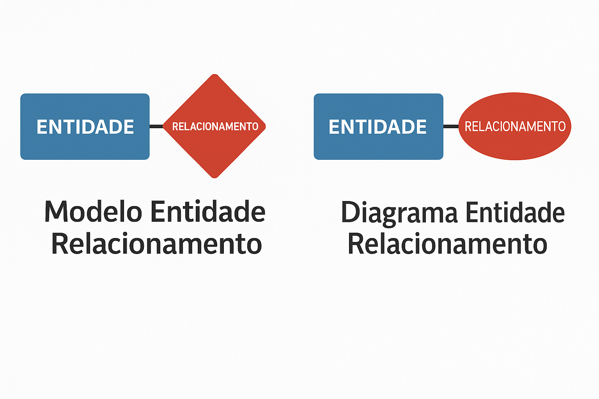

```{r setup, include=FALSE}
knitr::opts_chunk$set(echo = FALSE)
library(plantuml)


# Detectar o sistema operacional
so <- Sys.info()[["sysname"]]

if (so == "Linux")
{
  plantumlOptions(jar_path = "/usr/share/java/plantuml.jar")  
}else 
  if (so == "Windows") 
  {
    plantumlOptions(jar_path = "C:/PROGRA~1/COMMON~1/Oracle/Java/libs/plantuml-1.2025.4.jar")
  }else
  {
    print(paste("Sistema não reconhecido:", so))
  }


knitr::knit_engines$set(plantuml = function(options)
{
    code <- paste(options$code, collapse = "\n")
  
  if (is.null(options$plantuml.path)) 
  {
    path <-  "."
  } else
    {
      path <- options$plantuml.path
    }
  
  dir.create(path, showWarnings = FALSE, recursive = TRUE)
  fig <- paste0(options$label, ".", "svg")
  fig <- file.path(path, fig)
  if (options$eval) plot(x = plantuml(code), vector=FALSE, file=fig)
  knitr::engine_output(options, out = list(knitr::include_graphics(fig)))
})
```


# Sobre estas anotações {.unnumbered}

—————————————————————————————————————————————

Estas anotações são apenas lembretes das aulas expostas em sala, durante a disciplina de Banco de dados.

## ACESSO AO GITBOOK CELULAR

—————————————————————————————————————————————

#### <https://miguel7penteado.github.io/2025-2sem-GTI-BancoDeDados>


## Leitores de formato de arquivo EPUB para SmartPhone

—————————————————————————————————————————————

### ANDROID

#### **Moon+ Reader**

{width="340"}

## Livros Texto da Disciplina

—————————————————————————————————————————————

### ["Introdução a sistemas de bancos de dados" do autor "**Christopher John Date**"](https://www.kufunda.net/publicdocs/Introdu%C3%A7%C3%A3o%20a%20Sistemas%20de%20Bancos%20de%20Dados%20(C.%20J.%20Date)%20(z-lib.org).pdf)


+-----------------------+------------------------------------------------------------------------------------+
| **Autor(es)**         | ### [**Christopher John Date**](https://en.wikipedia.org/wiki/Christopher_J._Date) |
+-----------------------+------------------------------------------------------------------------------------+
| **Editora**           | LTC                                                                                |
+-----------------------+------------------------------------------------------------------------------------+
| **Idioma**            | Português                                                                          |
+-----------------------+------------------------------------------------------------------------------------+
| **ISBN**              | 978-85-352-8445-4                                                                  |
+-----------------------+------------------------------------------------------------------------------------+
| **Formato**           | Capa dura                                                                          |
+-----------------------+------------------------------------------------------------------------------------+
| **Páginas**           | 1623                                                                               |
+-----------------------+------------------------------------------------------------------------------------+
| **Código Biblioteca** |                                                                                    |
+-----------------------+------------------------------------------------------------------------------------+

### ["**Projeto de bancos de dados**" do autor "Carlos Alberto HEUSER"](https://drive.google.com/file/d/0B452rmbcudPSVFdCZ09vVkJUUUd2dlpMNS1vaEczUQ/view?pli=1&resourcekey=0-3MTcHlAYjPX6YSvBQGweUQ)


+-----------------------+-------------------------------------------------------------------------------------------+
| **Autor(es)**         | ### [Carlos Alberto HEUSER](https://www.inf.ufrgs.br/site/docente/carlos-alberto-heuser/) |
+-----------------------+-------------------------------------------------------------------------------------------+
| **Editora**           | Bookman                                                                                   |
+-----------------------+-------------------------------------------------------------------------------------------+
| **Idioma**            | Português                                                                                 |
+-----------------------+-------------------------------------------------------------------------------------------+
| **ISBN-10**           | 8577803821                                                                                |
+-----------------------+-------------------------------------------------------------------------------------------+
| **Formato**           | Impresso                                                                                  |
+-----------------------+-------------------------------------------------------------------------------------------+
| **Páginas**           | 282                                                                                       |
+-----------------------+-------------------------------------------------------------------------------------------+
| **Código Biblioteca** |                                                                                           |
+-----------------------+-------------------------------------------------------------------------------------------+

## Calendário das aulas

—————————————————————————————————————————————

##### AGOSTO DE 2025

| Data       | Dia da Semana | Aulas          | Conteúdo |
|------------|---------------|----------------|----------|
| 04/08/2025 | Segunda-Feira | Aula Inaugural |          |
| 11/08/2025 | Segunda-Feira | Aula 2         |          |
| 18/08/2025 | Segunda-Feira | Aula 3         |          |
| 25/08/2025 | Segunda-Feira | Aula 4         |          |

##### SETEMBRO DE 2025

| Data       | Dia da Semana | Aulas  | Conteúdo |
|------------|---------------|--------|----------|
| 01/09/2025 | Segunda-Feira | Aula 5 |          |
| 08/09/2025 | Segunda-Feira | Aula 6 |          |
| 15/09/2025 | Segunda-Feira | NP1    | PROVA    |
| 22/09/2025 | Segunda-Feira | Aula 7 |          |
| 29/09/2025 | Segunda-Feira | Aula 8 |          |

##### OUTUBRO DE 2025

| Data       | Dia da Semana | Aulas   | Conteúdo |
|------------|---------------|---------|----------|
| 06/10/2025 | Segunda-Feira | Aula 9  |          |
| 13/10/2025 | Segunda-Feira | Aula 10 |          |
| 20/10/2025 | Segunda-Feira | Aula 11 |          |
| 27/10/2025 | Segunda-Feira | Aula 12 |          |


##### NOVEMBRO DE 2025

| Data       | Dia da Semana | Aulas | Conteúdo |
|------------|---------------|-------|----------|
| 03/11/2025 | Segunda-Feira | NP2   | PROVA    |
| 10/11/2025 | Segunda-Feira |       | N/A      |
| 17/11/2025 | Segunda-Feira | SUB   | PROVA    |
| 24/11/2025 | Segunda-Feira |       | N/A      |


##### DEZEMBRO DE 2025

| Data       | Dia da Semana | Aulas | Conteúdo |
|------------|---------------|-------|----------|
| 01/12/2025 | Segunda-Feira |       | N/A      |
| 08/12/2025 | Segunda-Feira | EXAME | PROVA    |
| 15/12/2025 | Segunda-Feira |       | N/A      |


## Alunos 2025 - 2o Semestre

—————————————————————————————————————————————

### Campus Chácara Santo Antônio

#### Turma TI2P40

| Matrícula |          Nome do aluno         |
|:---------:|:------------------------------:|
| F362BF0   | BRUNO ANTONIO MARQUES          |
| R536FA6   | CAIO CESAR BALBINO DA SILVA    |
| H6094I1   | DOUGLAS VINICIUS M DOS SANTOS  |
| R6607G5   | GABRIEL ROQUE DOS SANTOS       |
| R8133G7   | ÍTALO KEVIN RODRIGUES DA SILVA |
| R837AA0   | LUCAS SOUZA RODRIGUES          |
| H714419   | MARCOS PAULO CORDEIRO GOES     |


<!--chapter:end:index.Rmd-->

---
output: 
  html_document: 
    highlight: tango
    theme: cerulean
---
# Aula Inaugural

#### 04/08/2025 {.unnumbered}

#### Professor Miguél Suares {.unnumbered}

## Disciplina: **Banco de Dados**

-   Curso: Gestão em Tecnologia da Informação (GTI)\
-   Período: **Noturno**\
-   Turma: **2º semestre de 2025**
-   Campus: **Chácara Santo Antônio**

> "Dados são o novo petróleo." – Clive Humby!

{width="300"}

------------------------------------------------------------------------

## 👨‍🏫 Sobre o Professor

-   Nome: Prof. Miguél Suares

-   Formação: Mestre em Engenharia da Computação e Energia da Agricultura

-   Experiência: +10 anos com bancos de dados relacionais e análise de dados

-   Contato: [miguel.penteado\@docente.unip.br](mailto:miguel.penteado@docente.unip.br)

------------------------------------------------------------------------

## 🎯 Objetivos da Disciplina

-   Compreender os fundamentos de bancos de dados

-   Modelar dados com diagramas ER

-   Implementar e consultar bases de dados com SQL

-   Utilizar ferramentas como MySQL, PostgreSQL, QGIS e R

-   Desenvolver raciocínio lógico para resolver problemas com dados

    {width="334"}

------------------------------------------------------------------------

## 📅 Calendário da Disciplina

| Data       | Aula    | Tema                          |
|------------|---------|-------------------------------|
| 04/08/2025 | Aula 1  | Aula Inaugural                |
| 11/08/2025 | Aula 2  | Fundamentos                   |
| 18/08/2025 | Aula 3  | Modelagem e Diagramas         |
| 25/08/2025 | Aula 4  | Administração e Gerenciamento |
| 01/09/2025 | Aula 5  | Aplicação CRUD                |
| 08/09/2025 | Aula 6  | MySQL                         |
| 15/09/2025 | **NP1** | **Prova**                     |
| 22/09/2025 | Aula 7  | Postgres                      |
| 29/09/2025 | Aula 8  | QGIS                          |
| 06/10/2025 | Aula 9  | RStudio                       |
| 13/10/2025 | Aula 10 | Análise I                     |
| 20/10/2025 | Aula 11 | Análise II                    |
| 27/10/2025 | Aula 12 | Análise III                   |
| 03/11/2025 | **NP2** | **Prova**                     |

------------------------------------------------------------------------

## 📚 Ementa Resumida

-   Introdução a bancos de dados relacionais (RDBMS)

-   Modelagem de dados (M.E.R.) e diagramas Entidade Relacionamento (D.E.R.)

-   Linguagem SQL: DDL, DML, DCL

-   Ferramentas: MySQL, PostgreSQL

-   Visualização geoespacial (QGIS)

-   Análise e exploração de dados (R e RStudio)

    {width="331"}

------------------------------------------------------------------------

## 📝 Avaliação

-   **Provas (NP1 + NP2)**
-   **Prova Substitutiva**
-   **Exame**

------------------------------------------------------------------------

## 🛠️ Ferramentas da Disciplina

-   **Servidores de Banco de Dados**: MySQL, PostgreSQL
-   **Servidores de Banco de Dados**: pgAdmin, MySQL Workbench, DBeaver\
-   **Geoprocessamento**: QGIS\
-   **Análise de Dados**: R + RStudio\
-   **Versionamento e Organização**: GitHub, Teams

------------------------------------------------------------------------

## 📌 Expectativas e Regras

-   Pontualidade e entrega de atividades no prazo
-   Trabalhos devem ser originais (sem plágio)
-   Participação ativa nas discussões e práticas
-   Uso responsável das ferramentas
-   Respeito e colaboração entre colegas

------------------------------------------------------------------------

## 💡 Dicas para Mandar Bem

-   Faça os exercícios logo após a aula
-   Participe das práticas com base real
-   Mantenha o repositório do projeto atualizado
-   Refaça consultas SQL até entender
-   Teste e documente suas soluções

------------------------------------------------------------------------

## 🙌 Encerramento

## Estamos prontos?

📧 Dúvidas? Estou à disposição\
📊 Vamos construir conhecimento juntos!

> Próxima aula: **Fundamentos de Banco de Dados** – 11/08/2025

<!--chapter:end:01-2025-08-04_Inaugural.Rmd-->

---
output: 
  html_document: 
    highlight: tango
    theme: cerulean
---
# Fundamentos de Sistemas de Bancos de Dados

#### 11/08/2025 {.unnumbered}

#### Professor Miguél Suares {.unnumbered}

------------------------------------------------------------------------

## O início : Edgar Frank "Ted" Codd (19/08/1923 – 18/04/2003)

-   Nome: Professor Codd - Matemático da IBM

    {width="134"}

-   1965: Cria modelo relacional nos tempos da IBM/NASA/Projeto Apolo

{width="334"}

-   1969: Codd não é levado a sério

-   1970: Publica a teoria relacional nas universidades (Berkley, Califórnia)

------------------------------------------------------------------------

## Anos 1970: IBM entra no Modelo relacional: SystemR e SEQUEL/SQL

-   1970: IBM entende a importância do modelo de Codd

-   1971: Como Codd publica o conhecimento, o projeto vai para *Raymond Francis Boyce*

    {width="138"}

-   1974: Donald D. Chamberlin e *Raymond Francis Boyce* criam a SQL na IBM

-   1973: *Raymond Francis Boyce* criam o SystemR (Banco Relacional da IBM)

-   Codd continua publicando artigos sobre modelo relacional

-   1977: Ex-alunos prof Michael StoneBraker fundam a (Relational Inc) ORACLE "copiando" o SystemR da IBM.

    {width="132"}

------------------------------------------------------------------------

## Anos 1970: Prof Codd inspira Prof StoneBraker: BANCO INGRES

-   1974: Michael StoneBraker começa projeto INGRES na Universidade de Berkley

    {width="202"}

-   1976: Nasce o INGRES, pai de muitos Bancos de Dados Modernos.

    {width="173"}

-   1976: INGRES nasce com linguagem prórpia, o QUEL, ao invés do SQL

-   INGRESS cria a empresa Relational INC

-   Ex-funcionários (alunos) da Relational Inc fundam a SYBASE.

------------------------------------------------------------------------

## Anos 1980: INGRES (SEMI-LIVRE) vs IBM System R ( pago ) vs ORACLE

-   1982 IBM transforma SystemR em IBM DB2.

-   1984 Ex-funcionários (alunos) da Relational Inc fundam a SYBASE.

    {width="257"}

-   1985: SoneBraker cria o PostGRES (Banco de Dados Objeto-Relacional)

-   1986: INGRES perde para a ORACLE no mercado de SGBDs

-   1989: SQL vira padrão ANSI e padrão ISO

------------------------------------------------------------------------

## Anos 1990: MySQL e POSTGRES que vira POSTGRESQL

-   1993: O SYBASE SQL Server é portado para o Windows NT 4.0

-   1994: Fim do relacionamento entre Microsoft e SYBASE: nasce o MS-SQL Server

-   1994: **Andrew Yu** e **Jolly Chen** Adicionam SQL ao POSTGRES: nasce o **PostgreSQL**

    {width="141"}

-   1994: David Axmark, Allan Larsson e Michael "Monty" Widenius criam o MySQL.

    {width="131"}

-   1997: Nasce o postgreSQL 6.0

-   1998: Carlo Strozzi - Modelo Não-SQL (conceito de SGBDs que não usam interface SQL)

------------------------------------------------------------------------

## Anos 2000: Sybase eo No-SQL

-   2003 - Doug Cutting e Mike Cafarella, projeto *Hadoop* baeado no documento *Google File System*

-   2007 - 10gen (MongoDB Inc) inicia o projeto MongoDB (Não SQL)

    {width="260"}

-   2007 - Avinash Lakshman do facebook disponibiliza o Apache Cassandra (Não SQL)

    {width="126"}

-   2008 - BIG DATA Lançado o Apache HADOOP e o Apache Hive (emulador SQL)

    {width="441"}BIG

    {width="139"}

------------------------------------------------------------------------

```R
rmarkdown::render("03-2025-08-19_20_.Rmd", output_dir="docs", output_file ="temporario.html" , output_format = "html_document") ; utils::browseURL("docs/temporario.html")
```

<!--chapter:end:02-2025-08-11_Fubdamentos_SGBD-aula.Rmd-->

## Exercícios

```{r geracao_arquivos, eval=FALSE, include=FALSE}
rmarkdown::render("03-2025-08-19_20_.Rmd", output_dir="docs", output_file ="temporario.html" , output_format = "html_document") ; utils::browseURL("docs/temporario.html")
```

<!--chapter:end:02-2025-08-11_Fubdamentos_SGBD-exercicio.Rmd-->

---
output: 
  html_document: 
    highlight: tango
    theme: cerulean
---

# Modelagem de Bancos de Dados

#### 18/08/2025 {.unnumbered}

#### Professor Miguél Suares {.unnumbered}

## Introdução: Visitando a teoria de Bancos de Dados

{width="452"}

> **Banco de Dados** Um banco de dados é uma coleção compartilhada de dados logicamente relacionados, projetada para atender às necessidades informacionais de uma organização. - *DATE, C. J. An Introduction to Database Systems. 8. ed. Boston: Addison-Wesley, 2003*.

Ou seja, alguns pontos-chave da definição de Date:

-   "Coleção de dados ..." → não é um conjunto de arquivos soltos, mas dados organizados.

-   "Compartilhada ..." → não pertence a apenas um usuário ou aplicação; é usada por vários.

-   "Dados logicamente relacionados ..." → os dados têm um relacionamento semântico, não são apenas agrupamentos arbitrários.

-   "Projetada para atender necessidades ..." → o banco existe para suportar os processos de uma organização (consultas, relatórios, controle, tomada de decisão).


> **Banco de Dados Relacional** Um banco de dados relacional é um banco de dados baseado em um modelo de dados relacional, no qual os dados são representados como um conjunto de relações (tabelas), e cada relação consiste em tuplas (linhas) e atributos (colunas). - *SILBERSCHATZ, Abraham; KORTH, Henry F.; SUDARSHAN, S. Database System Concepts. 6. ed. New York: McGraw-Hill, 2010.*

Agora, alguns pontos-chave da definição de *Abraham Silberschatz* :

-   Base no modelo relacional de Codd (1970).

-   Dados representados em tabelas (relações).

-   Cada tabela é composta de tuplas (linhas) e atributos (colunas).

-   Integridade garantida por restrições (chaves, integridade referencial, domínio de atributos).

-   Manipulação feita por linguagens relacionais (álgebra relacional, cálculo relacional, SQL).

O Banco de Dados Relacional organiza as informações em **tabelas bidiomensionais** constituídas de **linhas e colunas** chamadas e essas tabelas recebem o nome de **relações**. Cada **relação** possui um **campo-chave** que confere identificação exclusiva a cada registro da tabela.

## Modelo Matemático de um Banco de Dados

Considere um Banco de Dados para representar, com consistência Matemática os funcionários e Departamentos de uma Empresa.

### Podemos representa-lo matemáticamente utilizando a teoria dos conjuntos

```{r tikz-diagrama0, engine='tikz', echo=FALSE, fig.cap="Diagrama de Montadoras, Veículos e Proprietários"}
\usetikzlibrary{arrows,positioning,shapes,fit,calc}

\pgfdeclarelayer{background}
\pgfsetlayers{background,main}

\begin{tikzpicture}
[
  every node/.style={on grid},
  setA/.style={fill=blue ,circle,inner  sep=3pt},
  setB/.style={fill=green,circle,inner  sep=3pt},
  setC/.style={fill=red,rectangle,inner sep=3pt},
  every fit/.style={draw,fill=blue!25,ellipse,text width=25pt},
  >=latex
]

% Conjunto Montadoras
\node [setA,              label  = left:$Fulano$]  (a) {};
\node [setA,below = of a, label  = left:$Beltrano$]  (b) {};
\node [setA,below = of b, label  = left:$Ciclano$] (c) {};
\node [above      = of a, anchor = south] {$Funcionarios$};

% Conjunto Veiculos
\node[setB,inner sep=3pt,right  = 4 cm of a, label=right:$\text{RH}$]        (x) {};
\node[setB,inner sep=3pt,below  =    of x,   label=right:$\text{FINANÇAS}$]  (y) {};
\node[setB,inner sep=3pt,below  =    of y,   label=right:$\text{DIRETORIA}$] (z) {};
\node[above      = of x, anchor = south] {$Departamentos$};


% the arrows
%\draw[->,shorten >= 3pt] (a) -- node[label=above:$f(Corsa)$]  {} (x);
%\draw[->,shorten >= 3pt] (b) -- node[label=above:$g(Fiesta)$] {} (y);
%\draw[->,shorten >= 3pt] (c) -- node[label=above:$h(Gol)$]    {} (z);
%\draw[->,shorten <= 3pt] (x) -- node[label=above:$i(Fulano)$] {} (m);
%\draw[->,shorten <= 3pt] (y) -- node[label=above:$j(Beltrano)$] {} (n);
%\draw[->,shorten <= 3pt] (z) -- node[label=above:$k(Ciclano)$] {} (p);

%\draw[->] (n) -- node[label=above:$j(j(Beltrano))$] {} (y);

% the boxes around the sets
\begin{pgfonlayer}{background}
\node[fit= (a)  (c) ] {};
\node[fit= (x) (z)  ] {};
%\node[fit= (m) (p)  ] {};
\end{pgfonlayer}
\end{tikzpicture}

```

#### Edgard F Cood explica em sua obra "A Relational Model of Data for Large Shared Data Banks" como definir uma Banco de Dados compartilhado *matemáticamente*

> Um **banco de dados relacional** é um banco de dados no qual todos os dados são representados por meio de **relações (matematicamente, conjuntos de tuplas)**, e todas as operações sobre os dados são baseadas em operadores formais do cálculo relacional e da álgebra relacional. - *A Relational Model of Data for Large Shared Data Banks” (Communications of the ACM, vol. 13, n. 6, pp. 377–387, 1970).*

[](https://buttondown.com/jaffray/archive/in-codd-we-trust-or-not/)

### Então para podemos relacionar estes dois conjuntos (Funcionários e Departamentos) utilizando a Teoria das Funções

$$
\text{Edgard Frank Codd era um matemático tradicional} \\
\text{Considere o conseito de função: } \\
f(x) = Y \\
\text{era dessa forma que ele imaginava relacionamento e } \\
\text{ garantia matemática de CONSISTÊNCIA entre } \\
\text{ elementos de 2 conjuntos de dados diferentes }
$$

```{r tikz-diagrama10, engine='tikz', echo=FALSE, fig.cap="Diagrama de Montadoras, Veículos e Proprietários"}
\usetikzlibrary{arrows,positioning,shapes,fit,calc}

\pgfdeclarelayer{background}
\pgfsetlayers{background,main}

\begin{tikzpicture}[
  every node/.style={on grid},
  setA/.style={fill=blue!50,circle,inner sep=3pt},
  setB/.style={fill=green!50,circle,inner sep=3pt},
  >=latex
]

% Conjunto Funcionários
\node [setA,              label=left:$Fulano$]   (a) {};
\node [setA,below=of a,   label=left:$Beltrano$] (b) {};
\node [setA,below=of b,   label=left:$Ciclano$]  (c) {};

% Conjunto Departamentos
\node [setB,right=4cm of a, label=right:$\text{RH}$        ] (x) {};
\node [setB,below=of     x, label=right:$\text{Finanças}$  ] (y) {};
\node [setB,below=of     y, label=right:$\text{Diretoria}$ ] (z) {};

% As setas (funções)
\draw[->,shorten >=3pt] (a) -- node[above] {$trabalha(\text{RH})$}        (x);
\draw[->,shorten >=3pt] (b) -- node[above] {$trabalha(\text{Finanças})$}  (y);
\draw[->,shorten >=3pt] (c) -- node[above] {$trabalha(\text{Diretoria})$} (z);

% Os conjuntos
\begin{pgfonlayer}{background}
  \node[fit=(a) (c), ellipse, draw, fill=blue!10,  label=above:{Funcionários}] {};
  \node[fit=(x) (z), ellipse, draw, fill=green!10, label=above:{Departamentos}] {};
\end{pgfonlayer}

\end{tikzpicture}


```

Mas vai ficar faltando como representar os atributos nesse modelo (colunas das tabelas):

$$
\begin{array}{c| c | c}
\textbf{ Conjunto Funcionários}    & \textbf{ Relacionamento Trabalha} & \textbf{Conjunto Departamentos)} \\ 
\hline 
FULANO                             &  \quad TRABALHA                   & \quad RH \\
BELTRANO                           &  \quad TRABALHA                   & \quad FINANCEIRO \\
CICLANO                            &  \quad TRABALHA                   & \quad DEIRETORIA \\
\hline
\textbf{Total: 3 ELEMENTOS }       & \textbf{ CONECTADOS }             & \textbf{Total: 3 ELEMENTOS }
\end{array}
$$

Ainda, é necessário acrescentar algumas regras de integridade a representação;

## Modelo Lógico de Banco de Dados

### Modelo Conceitual "Entidade Relacionamento" de Banco de Dados

O Modelo Entidade-Relacionamento (MER), proposto por Peter Chen em 1976, é uma ferramenta fundamental na modelagem de dados. É um modelo de dados de alto nível que descreve a estrutura conceitual de um banco de dados. O Modelo Entidade-Relacionamento (MER) é representado graficamente através de um DER (Diagrama Entidade-Relacionamento).

[{width="173"}](https://personalidades-tecnologia.blogspot.com/2011/06/peter-pin-shan-chen-peter-pin-shan-chen.html)

É utilizado para projetar Bancos de Dados Relacionais a partir de entrevistas onde se descreve as informações que se deseja armazenar de forma consistente. Exemplo:

"*Desenhe um diagrama entidade-relacionamento DER contendo as entidades funcionarios e departamentos. A entidade "funcionários" possui os atributos "nome" e "CPF". A entidade "Departamentos" possui os atributos "Nome" e "sigla". O atributo "CPF" é chave primária da entidade "Funcionários". O atributo "sigla" é chave primária da entidade "Departamentos". As entidades "Funcionários" e "Departamentos" se relacionam através de um relacionamento chamado "Pertence"*."

```{plantuml Exemplo-01, plantuml.path="images"}
@startchen

left to right direction

entity FUNCIONARIOS {
  nome 
  cpf <<key>> 
}

entity DEPARTAMENTOS {
  nome 
  sigla <<key>> 
}

relationship PERTENCE {

}


FUNCIONARIOS  -1- PERTENCE
PERTENCE      -N- DEPARTAMENTOS

@endchen
```

Segundo Laudon

> **Diagrama Entidade/Relacionamento (DER)** é uma representação esquemática utilizada para entender as relações entre as tabelas de um banco de dados relacional. [[1] - LAUDON, Kenneth C.; LAUDON, Jane P. \*Sistemas de informação gerenciais\*. 11. ed. São Paulo: Pearson Education do Brasil, 2010. p. 180.]

### Composição e Significado do Diagrama Entidade Relacionamento (DER)

$$
\begin{array}{c| c | c}
\textbf{ NOME DO COMPONENTE}    & \textbf{Representação Gráfica}   & \textbf{ Liguagem Natural (texto)} \\ 
\hline 
ENTIDADE                        &  \quad RETÂNGULO                 & \quad SUBSTÃNTIVO \\
ATRIBUTO                        &  \quad ELÍPSE                    & \quad ADJETIVO \\
RELACIONAMENTO                  &  \quad LOSÂNGULO                 & \quad VERBO \\
\hline
\textbf{Total: 3 ELEMENTOS }    & \textbf{ FORMA GRÁFICA }         & \textbf{ FORMA MOFOLÓGICA GRAMATICAL }
\end{array}
$$

```{r tikz-diagrama-DER-00, engine='tikz', echo=FALSE, fig.cap="Diagrama de Montadoras, Veículos e Proprietários"}
\usetikzlibrary{arrows,positioning,shapes,fit,calc}

\pgfdeclarelayer{background}
\pgfsetlayers{background,main}

\begin{tikzpicture}

  %--- Retângulo à esquerda ---
  \begin{scope}[shift={(0,0)}]
    \draw[thick] (0,0) rectangle (3,2);
    \node at (1.5,1) {Retângulo};
  \end{scope}

  %--- Elipse ao centro (deslocada 5 cm à direita) ---
  \begin{scope}[shift={(5,0)}]
    \draw[thick] (0,1) ellipse (1.5cm and 1cm);
    \node at (0,1) {Elipse};
  \end{scope}

  %--- Losango à direita (deslocado 10 cm à direita) ---
  \begin{scope}[shift={(9,0.9)}]
    \draw[thick] (0,1.5) -- (1.5,0) -- (0,-1.5) -- (-1.5,0) -- cycle;
    \node at (0,0) {Losango};
  \end{scope}


\end{tikzpicture}


```

## Modelo Físico de Banco de Dados

### Geração do modelo Físico para aplica-lo ao SGBD (Sistema de Gerenciamento de Banco de Dados):

Uma vez que o modelo conceitual seja gerado, o analista pode mapea-lo para um "modelo físico". Aqui, cada entidade irá gerar uma tebela, cada atributo irá originar uma coluna pertinente da tabela em questão e cada relacionamento irá mapear **chaves primárias** e **chaves forasteiras** nas tabelas interrelacionadas.

$$
\begin{array}{c| c | c}
\textbf{Componente Lógico}    & \textbf{ Componente Físico}   & \textbf{Liguagem Natural (texto)} \\ 
\hline 
ENTIDADE                        &  \quad TABELA               & \quad SUBSTÃNTIVO \\
ATRIBUTO                        &  \quad COLUNA               & \quad ADJETIVO \\
RELACIONAMENTO                  &  \quad CHAVE-ESTRANGEIRA    & \quad VERBO \\
\hline
\textbf{Diagrama Lógico DER }    & \textbf{ FORMA FÍSICA - SGBD }    & \textbf{ FORMA MOFOLÓGICA GRAMATICAL ORIGINAL }
\end{array}
$$

A ferramenta que irá criar as estruturas Físicas (tabelas, colunas, chaves) dentro do Banco de Dados é o Sistema de Gerenciamento de Banco de Dados através da linguagem **SQL**.


### Interagindo com o Modelo Físico - A linguagem SQL (Structured Query Language)

A linguagem SQL foi criada nos laboratórios da IBM em 1974, como interface de manipulação ao Bando de Dados Relacional System-R , atualmente denominado IBM DB2. Os criadores foram engenheiros de sistemas que sucederam o professor Edgard Frank Codd no projeto de Banco de Dados Relacional: Donald Chamberlain e Raymond Boyce.

+----------------------------------------------------------------------------------------------------------------------------------------+------------------------------------------------------------------------------------------------------------------------------+
| {width="358"} | {width="238"} |
+----------------------------------------------------------------------------------------------------------------------------------------+------------------------------------------------------------------------------------------------------------------------------+

A lingauem SQL é a ponte com o mundo exterior para um Sistema de Gerenciamento de Banco de Dados (SGBD). Os conjunto de comandos da linguagem SQL são divididos em 3 grandes grupos:

$$
\begin{array}{c| c | c}
\textbf{GRUPO}    & \textbf{ Comandos}   & \textbf{Finalidade} \\ 
\hline 
Grupo \ DDL         &  \quad \ Data \ Definion \ Language        & \quad Criar \ estruturas \ de \ dados \\
Grupo \ DML         &  \quad \ Data \ Manipulation \ Language    & \quad Manipular \ dados \ armazenados \\
Grupo \ DCL         &  \quad \ Data \ Control \ Language         & \quad Criar \ Regras \ para \ os \ dados \\
Grupo \ TCL         &  \quad \ Transaction \ Control \ Language  & \quad Criar \ Transações \ para \ os \ dados \\
\hline
\textbf{Subconjunto SQL }    & \textbf{ Significado }    & \textbf{ Conjunto Completo }
\end{array}
$$

Comandos exemplo:

$$
\begin{array}{c| c }
\textbf{GRUPO}    & \textbf{ Comandos}    \\ 
\hline 
Grupo \ DDL         &  \quad  CREATE, \quad ALTER,\quad DROP \ \        \\
Grupo \ DML         &  \quad SELECT, \quad INSERT, \quad UPDATE, \quad DELETE, \quad JOIN    \\
Grupo \ DCL         &  \quad GRANT, \quad REVOKE  \\
Grupo \ TCL         &  \quad COMMIT, \quad ROLLBACK, \quad SAVEPOINT   \\
\hline
\textbf{Subconjunto SQL }    & \textbf{ Significado }     
\end{array}
$$

O código abaixo escrito em Lingauem SQL padrão transfere para o modelo físico o modelo lógico anterior:

```{plantuml Exemplo-01-continuação, plantuml.path="images"}
@startchen

left to right direction

entity FUNCIONARIOS {
  nome 
  cpf <<key>> 
}

entity DEPARTAMENTOS {
  nome 
  sigla <<key>> 
}

relationship PERTENCE {

}


FUNCIONARIOS  -1- PERTENCE
PERTENCE      -N- DEPARTAMENTOS

@endchen
```

Transformando em SQL - EQUIVALENTE:

``` sql
-- Exemplo testado e gerado no SGBD Postgres versão 15

-- Tabela Funcionários
CREATE TABLE IF NOT EXISTS "public".funcionarios
(
    cpf bigint NOT NULL,
    nome varchar(200)
);

-- Tabela Departamentos

CREATE TABLE IF NOT EXISTS "public".departamentos
(
    sigla integer NOT NULL,
    nome varchar(200)
);

-- Definindo a coluna "cpf" da tabela "funcionários" como chave primária
alter table "public".funcionarios add constraint "chave_primaria_funcionarios" primary key (cpf);

-- Definindo a coluna "sigla"" da tabela "departamentos" como chave primária
alter table "public".departamentos add constraint "chave_primaria_departamentos" primary key (sigla);

-- Gerando a integridade referêncial 
-- Importando a chave primária da tabela "departamentos" como "chave estrangeira"
-- na tabela "funcionários"

-- primeiro adiciona-se a coluna estrageira "sigla" que é coluna originalmente 
-- pertencente a tabela departamentos
alter table "public".funcionarios add column sigla integer;

-- finalmente conecte a coluna sigla a chave primária da tabela "departamento"
-- criando então uma chave estrageira na tabela "funcionários".
alter table "public".funcionarios add constraint "Chave_estrangeira_Departamento_funcionarios" foreign key (sigla) references "public".departamentos(sigla);
```

## EXEMPLO: REVENDA DE VEÍCULOS MULTI-MARCAS

Uma revenda de veículos multimarcas deseja informatizar seu negócio e precisa de um banco de dados que registre informações sobre veículos, fabricantes e clientes. Cada veículo deve ter código de identificação, modelo, ano de fabricação, cor, preço e chassi. Todo veículo pertence a um fabricante. O fabricante é identificado por um código e deve ter armazenados seu nome e país de origem. A revenda vende veículos para clientes, e cada venda deve registrar a data, o valor da negociação e a forma de pagamento. Um cliente pode comprar mais de um veículo, mas cada veículo só pode ser vendido uma vez. Cada cliente é identificado por um código e deve ter armazenados seu nome, CPF/CNPJ, telefone e endereço.

### Passo 1 - Visualizando matemáticamente os dados:

Vejamos como ficaria representar matemáticamente o enunciado acima:

-   Teoria dos Conjuntos - Ajudaria a organizar e agrupar os dados em conjuntos;

-   Teoria das Funções - A idéia era fornecer um mecanismo de consistência aos dados de conjuntos diferentes relacionados. Por exemplo, haveria uma função que mapeasse um um elemento do conjunto `veículo` a outro elemento do conjunto `montadora`.

#### Representação Matemática em Conjuntos e seus Elementos :

Vamos visualizar gráficamente os conjuntos de `Marcas`, `modelos` e `proprietários` :

```{r tikz-diagrama1, engine='tikz', echo=FALSE, fig.cap="Diagrama de Montadoras, Veículos e Proprietários"}
\usetikzlibrary{arrows,positioning,shapes,fit,calc}

\pgfdeclarelayer{background}
\pgfsetlayers{background,main}

\begin{tikzpicture}
[
  every node/.style={on grid},
  setA/.style={fill=blue ,circle,inner  sep=3pt},
  setB/.style={fill=green,circle,inner  sep=3pt},
  setC/.style={fill=red,rectangle,inner sep=3pt},
  every fit/.style={draw,fill=blue!25,ellipse,text width=25pt},
  >=latex
]

% Conjunto Montadoras
\node [setA,              label  = left:$Chevrolet$]  (a) {};
\node [setA,below = of a, label  = left:$Ford$]       (b) {};
\node [setA,below = of b, label  = left:$VolksWagen$] (c) {};
\node [above      = of a, anchor = south] {$Montadoras$};

% Conjunto Veiculos
\node[setB,inner sep=3pt,right  = 4 cm of a, label  = right:$Corsa$]  (x) {};
\node[setB,inner sep=3pt,below  =      of x, label  = right:$Fiesta$] (y) {};
\node[setB,inner sep=3pt,below  =      of y, label  = right:$Gol$]    (z) {};
\node[above      = of x, anchor =     south] {$Veiculos$};

% Conjunto Proprietarios
\node[setC,label=right:$Fulano$,right   = 4 cm of x] (m) {};
\node[setC,label=right:$Beltrano$,below =     of m] (n) {};
\node[setC,label=right:$Ciclano$,below  =     of n] (p) {};
\node[above=of m,anchor=south] {$Proprietarios$};


% the boxes around the sets
\begin{pgfonlayer}{background}
\node[fit= (a)  (c) ] {};
\node[fit= (x) (z)  ] {};
\node[fit= (m) (p)  ] {};
\end{pgfonlayer}
\end{tikzpicture}

```

#### Gerando os Relacionamentos "Matemáticamente" - (Teoria das Funções, Domínios e Imagens):

Vamos visualizar gráficamente os relacionamentos entre os lementos dos conjuntos `Marcas`, `modelos` e `proprietários` :

```{r tikz-diagrama2, engine='tikz', echo=FALSE, fig.cap="Diagrama de Montadoras, Veículos e Proprietários"}
\usetikzlibrary{arrows,positioning,shapes,fit,calc}
\pgfdeclarelayer{background}
\pgfsetlayers{background,main}

\begin{tikzpicture}[
  every node/.style={on grid},
  setA/.style={fill=blue ,circle,inner sep=3pt},
  setB/.style={fill=green,circle,inner sep=3pt},
  setC/.style={fill=red,rectangle,inner sep=3pt},
  every fit/.style={draw,fill=blue!25,ellipse,text width=25pt},
  >=latex
]

\node [setA,              label=left:$Chevrolet$]  (a) {};
\node [setA,below = of a, label=left:$Ford$]       (b) {};
\node [setA,below = of b, label=left:$VolksWagen$] (c) {};
\node [above=of a,anchor=south] {$Montadoras$};

\node[setB,inner sep=3pt,right=4cm of a, label  = above:$Corsa$]  (x) {};
\node[setB,inner sep=3pt,below=of x    , label  = above:$Fiesta$] (y) {};
\node[setB,inner sep=3pt,below=of y    , label  = above:$Gol$]    (z) {};
\node[above=of x,anchor=south] {$Veiculos$};

\node[setC,label=right:$Fulano$,right=4cm of x] (m) {};
\node[setC,label=right:$Beltrano$,below=of m] (n) {};
\node[setC,label=right:$Ciclano$,below=of n] (p) {};
\node[above=of m,anchor=south] {$Proprietarios$};

\draw[->,shorten >= 3pt] (a) -- node[label=above:$f(Corsa)$] {} (x);
\draw[->,shorten >= 3pt] (b) -- node[label=above:$g(Fiesta)$] {} (y);
\draw[->,shorten >= 3pt] (c) -- node[label=above:$h(Gol)$]    {} (z);
\draw[->,shorten <= 3pt] (x) -- node[label=above:$i(Fulano)$] {} (m);
\draw[->,shorten <= 3pt] (y) -- node[label=above:$j(Beltrano)$] {} (n);
\draw[->,shorten <= 3pt] (z) -- node[label=above:$k(Ciclano)$] {} (p);

\begin{pgfonlayer}{background}
\node[fit=(a)(c)] {};
\node[fit=(x)(z)] {};
\node[fit=(m)(p)] {};
\end{pgfonlayer}
\end{tikzpicture}
```

A limitação desta representação gráfica logo fica evidente: por mais que na forma matemática se consiga representar os elementos dos conjuntos e o relacionamento entre eles, a representação não consegue representar os diferentes atributos (características) que os elementos dos conjuntos compartilham.

### Modelo Lógico: Modelo Entidade Relacionamento

Vamos agora converter a representação matemática para uma representação lógica utilizando o modelo M.E.R. (modelo entidade-relacionamento ) proposto pelo professor Peter Chen

#### Modelo Entidade Relacionamento

O modelo Entidade Relacionamento consistem em traduzir elementos morfológicos da gramática da língua portuguesa em um texto para um modelo de Banco de dados utilizando a com a seguinte regra de montagem:

+-------------------------------+--------------------------------------+----------------------------------+---------------------------------------------+
| Classe morfológica da palavra | CORRESPONDÊNCIA NO MODELO MATEMÁTICO | CORRESPONDÊNCIA NO MODELO LÓGICO | CORRESPONDÊNCIA NO MODELO FÍSICO-RELACIONAL |
+-------------------------------+--------------------------------------+----------------------------------+---------------------------------------------+
| `Substantivos`                | `CONJUNTOS`                          | `ENTIDADES`                      | `TABELAS`                                   |
+-------------------------------+--------------------------------------+----------------------------------+---------------------------------------------+
| **`Adjetivos`**               | N/A                                  | **`ATRIBUTO`**                   | **`COLUNAS`**                               |
+-------------------------------+--------------------------------------+----------------------------------+---------------------------------------------+
| **`Verbos`**                  | Idéia de "funções y=f(x) "           | **`RELACIONAMENTOS`**            | **`CHAVE ESTRANGEIRA`**                     |
+-------------------------------+--------------------------------------+----------------------------------+---------------------------------------------+

Tomando como exemplo a revenda de carros:

+-------------------------------+-----------------------------------------------------------------------------+
| Classe morfológica da palavra |                                                                             |
+-------------------------------+-----------------------------------------------------------------------------+
| `Substantivos`                | VEÍCULOS, FABRICANTES, CLIENTES                                             |
+-------------------------------+-----------------------------------------------------------------------------+
| **`Adjetivos`**               | Referentes a veículos: `Modelo`, `Ano_Fabricacao`, `Cor`, `Preco`, `Chassi` |
|                               |                                                                             |
|                               | Referentes a fabricante: `Nome`, `Pais_Origem`                              |
|                               |                                                                             |
|                               | Referentes a cliente: `Nome`, `CPF_CNPJ`, `Telefone`, `Endereco`            |
+-------------------------------+-----------------------------------------------------------------------------+
| **`Verbos`**                  | Fabricante - `PRODUZ`- Veículo                                              |
|                               |                                                                             |
|                               | clinte - `COMPRA/VENDE` - Veículo                                           |
+-------------------------------+-----------------------------------------------------------------------------+

#### Modelo Entidade Relacionamento - representação gráfica

|                               |                       |
|-------------------------------|-----------------------|
| Classe morfológica da palavra | REPRESENTAÇÃO GRÁFICA |
| `Substantivos`                | RETÂNGULOS            |
| **`Adjetivos`**               | **ELIPSES**           |
| **`Verbos`**                  | **LOSÂNGULOS**        |

```{plantuml modelo01, plantuml.path="images"}
@startchen


entity VEICULOS {
  Modelo
  Ano_Fabricacao
  Cor
  Preco
  Chassi <<key>>
}

entity FABRICANTES {
  CNPJ <<key>>
  Nome
  Pais_Origem
}


entity CLIENTES {
  Nome
  CPF_CNPJ <<key>>
  Telefone
  Endereco
}

relationship PRODUZEM {
  
}

relationship COMPRA_VENDE {

}


FABRICANTES -1- PRODUZEM
PRODUZEM    -N- VEICULOS

CLIENTES     -N- COMPRA_VENDE
COMPRA_VENDE -1- VEICULOS

@endchen
```


```SQL


-- ================================================
-- 1) TRANSFORME AS ENTIDADES E ATRIBUTOS EM 
--    TABELAS E COLUNAS
-- ================================================
CREATE TABLE fabricantes
(
    codigo_fabricante  INTEGER      NOT NULL,
    nome               VARCHAR(100) NOT NULL,
    pais_origem        VARCHAR(60)  NOT NULL
);

CREATE TABLE clientes
(
    codigo_cliente   INTEGER      NOT NULL,
    nome             VARCHAR(120) NOT NULL,
    cpf_cnpj         VARCHAR(20)  NOT NULL UNIQUE,
    telefone         VARCHAR(30),
    endereco         TEXT
);

CREATE TABLE veiculos 
(
    codigo_veiculo      INTEGER       NOT NULL,
    modelo              VARCHAR(100)  NOT NULL,
    ano_fabricacao      INTEGER       NOT NULL,
    cor                 VARCHAR(40),
    preco               NUMERIC(12,2) NOT NULL,
    chassi              VARCHAR(30)   UNIQUE NOT NULL
);

CREATE TABLE vendas
(
    codigo_venda     INTEGER          NOT NULL,
    data_venda       DATE             NOT NULL,
    valor_negociado  NUMERIC(12,2)    NOT NULL,
    forma_pagamento  VARCHAR(50)      NOT NULL
);

-- ================================================
-- 2) TRANSFORME OS ATRIBUTOS CHAVE PRIMÁRIA
-- EM CHAVES-PRIMÁRIAS DAS TABELAS
-- ================================================
ALTER TABLE fabricantes ADD CONSTRAINT chave-primaria_fabricante PRIMARY KEY (codigo_fabricante);

ALTER TABLE clientes    ADD CONSTRAINT chave-primaria_cliente PRIMARY KEY (codigo_cliente);

ALTER TABLE veiculos    ADD CONSTRAINT chave-primaria_veiculo PRIMARY KEY (codigo_veiculo);

ALTER TABLE vendas      ADD CONSTRAINT chave-primaria_venda PRIMARY KEY (codigo_venda);

-- ================================================
-- 3) ADICIONAR NAS TABELAS AS COLUNAS EXTRAS
--    QUE VÃO RECEBER AS CHAVES ESTRANGEIRAS
-- ================================================

-- adicione uma coluna que irá acomodar a chave primária da tabela fabricantes como chave estrangeira
ALTER TABLE veiculos add cloumn  codigo_fabricante   INTEGER NOT NULL;

-- adicione uma coluna que irá acomodar a chave primária da tabela clientes como chave estrangeira
ALTER TABLE vendas   add cloumn  codigo_cliente      INTEGER NOT NULL;

-- adicione uma coluna que irá acomodar a chave primária da tabela veículos como chave estrangeira
ALTER TABLE vendas   add cloumn  codigo_veiculo      INTEGER NOT NULL UNIQUE;

-- ================================================
-- 3) CRIE AS CHAVES ESTRANGEIRAS QUE FAZEM A LIGAÇÃO
-- DAS TABELAS "LADO N" DO RELACIONAMENTO NO 
-- DIAGRAMA ENTIDADE-RELACIONAMENTO COM AS
-- COLUNAS DO LADO 1
-- ================================================

-- utilizando chave estrangeira, faça esta tabela veículos referenciar a tabela fabricantes
ALTER TABLE veiculos
    ADD CONSTRAINT chave-estrageira_veiculo_fabricante
    FOREIGN KEY (codigo_fabricante)
    REFERENCES fabricantes (codigo_fabricante)
    ON UPDATE CASCADE
    ON DELETE RESTRICT;

-- utilizando chave estrangeira, faça esta tabela vendas referenciar a tabela clientes
ALTER TABLE vendas
    ADD CONSTRAINT chave-estrageira_venda_cliente
    FOREIGN KEY (codigo_cliente)
    REFERENCES clientes (codigo_cliente)
    ON UPDATE CASCADE
    ON DELETE RESTRICT;

-- utilizando chave estrangeira, faça esta tabela vendas referenciar a tabela veículos 
ALTER TABLE vendas
    ADD CONSTRAINT chave-estrageira_venda_veiculo
    FOREIGN KEY (codigo_veiculo)
    REFERENCES veiculos (codigo_veiculo)
    ON UPDATE CASCADE
    ON DELETE RESTRICT;

```

## VERBOS: Relacionamentos e Cardinalidade

A **cardinalidade** define **quantas ocorrências de uma entidade podem estar associadas** a ocorrências de outra entidade em um relacionamento.

Ela é fundamental para entender as regras de negócio do banco de dados e deve estar sempre representada no **Diagrama Entidade-Relacionamento (DER)**.

------------------------------------------------------------------------

### 🔹 Tipos principais de cardinalidade

1.  **Um para Um (1:1)**\
2.  **Um para Muitos (1:N)**\
3.  **Muitos para Muitos (N:N)**

A seguir, vamos detalhar cada caso.

------------------------------------------------------------------------

### 1. Relacionamento **1:1 (Um para Um)**

Um exemplo clássico:\
- Cada MARIDO possui **uma única ESPOSA**.\
- Cada ESPOSA pertence a **um único MARIDO**.

#### Representação no DER:

```{plantuml cardinalidade01, plantuml.path="images"}
@startchen
left to right direction

entity MARIDOS {
  nome 
  cpf <<key>> 
}

entity ESPOSAS {
  nome
  cpf <<key>> 
}

relationship POSSUI {

}

MARIDOS -1- POSSUI 
POSSUI  -1- ESPOSAS

@endchen
```

### Relacionamento **1:N (Um para Muitos)**

Exemplo:

Um **Cliente** pode fazer **muitos Pedidos**.

Mas cada **Pedido** só pode pertencer a **um Cliente**.

#### Representação no DER:

```{plantuml cardinalidade02, plantuml.path="images"}
@startchen
left to right direction

entity CLIENTES {
  nome 
  cpf <<key>> 
}

entity PASSAGENS {
  DATA
  HORA
  PARTIDA
  DESTINO
  NUMERO <<key>> 
}

relationship COMPRA {

}

CLIENTES -1- COMPRA 
COMPRA   -N- PASSAGENS

@endchen
```

### Relacionamento N:N (Muitos para Muitos)

Exemplo:

Um **Aluno** pode se matricular **em muitas Disciplinas**.

Cada **Disciplina** pode ter **muitos Alunos**.

( Esse tipo de relacionamento precisa de uma entidade associativa para ser implementado no banco (ex.: Matricula) )

#### Representação no DER:

```{plantuml cardinalidade03, plantuml.path="images"}
@startchen
left to right direction

entity ALUNOS {
  nome 
  RA <<key>> 
}

entity DISCIPLINAS {
  cOD_DISCIPLINA <<KEY>>
  NOME
  CONTEUDO
  DURACAO
}

relationship CURSAM {

}

ALUNOS   -N- CURSAM
CURSAM   -N- DISCIPLINAS

@endchen
```

## Entidade Dominante e Entidade Subordinada

No **Modelo Entidade-Relacionamento (MER)**, algumas entidades só existem **dependendo da existência de outra**.\
Nesses casos, usamos os conceitos de **Entidade Dominante** e **Entidade Subordinada**.

------------------------------------------------------------------------

### Definições:

-   **Entidade Dominante (ou Forte):**\
    É uma entidade que **existe por si só**, sem depender de nenhuma outra.\
    Ex.: Cliente, Produto, Funcionário.

-   **Entidade Subordinada (ou Fraca):**\
    É uma entidade que **depende de outra** para existir.\
    Ela **não possui chave primária própria** completa e precisa da chave da entidade dominante.\
    Ex.: ItemPedido, Dependente, Parcela.

A entidade subordinada é representada por um **losango duplo** (relacionamento identificador) em algumas notações, ou simplesmente destacada como **entidade fraca**.

```{plantuml EntidadeDominante01, plantuml.path="images"}
@startchen
left to right direction

entity PAIS {
  nome 
  RA <<key>> 
}

entity FILHOS <<weak>> {
  Nome nome
}

relationship POSSUEM {

}

PAIS      -1- POSSUEM
POSSUEM   -N- FILHOS

@endchen
```

Outro Exemplo:

```{plantuml EntidadeDominante02, plantuml.path="images"}
@startchen
left to right direction

entity PEDIDOS_VENDAS {
  CODIGO_PEDIDO <<KEY>>
  DATA
  VALOR_TOTAL
}

entity ITEMS_PEDIDO <<weak>> {
  ID_ITEM
  DESCRICAO
  QUANTIDADE
  PERCO_UNITARIO
}

relationship POSSUEM {

}

PEDIDOS_VENDAS  -1- POSSUEM
POSSUEM         -N- ITEMS_PEDIDO

@endchen
```

------------------------------------------------------------------------

## CARDINALIDADE DO MODELO LÓGICO E A CRIAÇÃO DE CHAVES ESTRANGEIRAS NO MODELO FÍSICO-RELACIONAL

Vai ser a cardinalidade que irá ditar em quais tabelas criaremos chaves estrangeiras.


## Normalização em Bancos de Dados Relaionais

### Tabela Desnormalizada

{width="343"}

Considere a tabela Veículos abaixo:

|  Modelo   | Montadora  |
|:---------:|:----------:|
|  Strada   |    Fiat    |
|   Mobi    |    Fiat    |
|   Pulse   |    Fiat    |
|   Onix    | Chevrolet  |
|  Tracker  | Chevrolet  |
| Onix Plus | Chevrolet  |
|   Polo    | Volkswagen |
|   Nivus   | Volkswagen |
|  T-Cross  | Volkswagen |
|   HB20    |  Hyundai   |
|   Creta   |  Hyundai   |

Separamos o conjunto de elemntos *Montadoras* e *Modelos*.

| MontadoraID | Montadora  |
|:-----------:|:----------:|
|      1      |    Fiat    |
|      2      | Chevrolet  |
|      3      | Volkswagen |
|      4      |  Hyundai   |

| ModeloID |  Modelo   |
|:--------:|:---------:|
|   101    |  Strada   |
|   102    |   Mobi    |
|   103    |   Pulse   |
|   201    |   Onix    |
|   202    |  Tracker  |
|   203    | Onix Plus |
|   301    |   Polo    |
|   302    |   Nivus   |
|   303    |  T-Cross  |
|   401    |   HB20    |
|   402    |   Creta   |

> O processo de fragmentar agrupamentos complexos de dados e simplifica-los a fim de minimizar redundâncias e economizar espaço no Banco de Dados Relacional é chamado de **NORMALIZAÇÃO.** [[1] - LAUDON, Kenneth C.; LAUDON, Jane P. \*Sistemas de informação gerenciais\*. 11. ed. São Paulo: Pearson Education do Brasil, 2010. p. 180.]

Mas Como indicar que cada elemento da tabela "Modelo" está associado a um elemento da tabela "Montadora" ?

### Tabela Normalizada

Considere as tabelas abaixo:

| MontadoraID | Montadora  |
|:-----------:|:----------:|
|      1      |    Fiat    |
|      2      | Chevrolet  |
|      3      | Volkswagen |
|      4      |  Hyundai   |

| ModeloID |  Modelo   | MontadoraID |
|:--------:|:---------:|:-----------:|
|   101    |  Strada   |      1      |
|   102    |   Mobi    |      1      |
|   103    |   Pulse   |      1      |
|   201    |   Onix    |      2      |
|   202    |  Tracker  |      2      |
|   203    | Onix Plus |      2      |
|   301    |   Polo    |      3      |
|   302    |   Nivus   |      3      |
|   303    |  T-Cross  |      3      |
|   401    |   HB20    |      4      |
|   402    |   Creta   |      4      |

Repare que:

-   É possível identificar que não existem montadoras repetidas na tabela "Montadoras";

-   É possível identificar que não existem modelos repetidos na tabela "Montadoras";

A coluna (atributo) **ModeloID** é a **chave primária** da tabela **Modelos.** A coluna (atributo) **MontadoraID** é a **chave primária** da tabela **Montadoras.**

Na tabela **Modelos**, a coluna **MontadoraID**, acrescentada a tabela Modelos representa a ligação de cada elemento da tabela Modelos e Montadoras. Essa coluna "importada" da tabela Montadoras para a tabela Modelos se chama **chave estrangeira**.

## Referências

**CHEN**, Peter (1990). ***Gerenciando Banco de Dados*****. A Abordagem Entidade-Relacionamento para Projeto Lógico**. São Paulo: McGraw-Hill. 80 páginas. [ISBN](https://pt.wikipedia.org/wiki/International_Standard_Book_Number "International Standard Book Number") [0-07-460575-5](https://pt.wikipedia.org/wiki/Especial:Fontes_de_livros/0-07-460575-5 "Especial:Fontes de livros/0-07-460575-5")

**DATE**, C. J. **An Introduction to Database Systems.** 8. ed. Boston: Addison-Wesley, 2003.

**SILBERSCHATZ**, Abraham; KORTH, Henry F.; SUDARSHAN, S. **Database System Concepts.** 6. ed. New York: McGraw-Hill, 2010.

**CODD**, E. F. **A Relational Model of Data for Large Shared Data Banks.** Communications of the ACM, New York, v. 13, n. 6, p. 377–387, 1970.

<!--chapter:end:03-2025-08-18_Modelagem_SGBD-aula.Rmd-->

---
output: 
  html_document: 
    highlight: tango
    theme: cerulean
---

## Exercícios RESOLVIDOS

+--------------------------------------------------------------------------------------------------------------------------------------------------------------------------------------------------------------------------------------------------------------------------------------------+
| Exercício 1 — Universidade                                                                                                                                                                                                                                                                 |
+============================================================================================================================================================================================================================================================================================+
| Considere uma Universidade que possui vários Cursos. Cada curso tem um nome, uma duração em semestres e um coordenador. A universidade possui Professores, cada um com um nome, título e CPF. Um professor pode ministrar várias disciplinas, e cada disciplina pertence a um único curso. |
+--------------------------------------------------------------------------------------------------------------------------------------------------------------------------------------------------------------------------------------------------------------------------------------------+
| a)  Identifique as entidades                                                                                                                                                                                                                                                               |
+--------------------------------------------------------------------------------------------------------------------------------------------------------------------------------------------------------------------------------------------------------------------------------------------+
| b)  Identifique os atributos de cada Entidade                                                                                                                                                                                                                                              |
+--------------------------------------------------------------------------------------------------------------------------------------------------------------------------------------------------------------------------------------------------------------------------------------------+
| c)  Identifique os relacionamentos entre as Entidades                                                                                                                                                                                                                                      |
+--------------------------------------------------------------------------------------------------------------------------------------------------------------------------------------------------------------------------------------------------------------------------------------------+
| e)  Faça o diagrama DEM (Diagrama Entidade Relacionamento) contendo as entidades, atributos e relacionamentos que você mapeou.                                                                                                                                                             |
+--------------------------------------------------------------------------------------------------------------------------------------------------------------------------------------------------------------------------------------------------------------------------------------------+

#### Passo #1 -

Identificar **SUBSTANTIVOS** no contexto; identificar os **ADJETIVOS** pertinentes a cada SUBSTANTIVO; identificar os **VERBOS** de relação entre os substantivos.

+---------------------------------------------------+----------------------------------------------+----------------------------------------------------+
| `Substantivos` **do contexto**: leve-os ao plural | `Adjetivos`                                  | `Verbos`                                           |
+:==================================================+==============================================+====================================================+
| UNIVERSIDADE -\> **`UNIVERSIDADES`**              | `NOME` (implícito no enunciado)              | universidade `POSSUI` (vários) cursos              |
|                                                   |                                              |                                                    |
|                                                   | `CNPJ` (implícito no enunciado)              |                                                    |
+---------------------------------------------------+----------------------------------------------+----------------------------------------------------+
| CURSO -\> **`CURSOS`**                            | `NOME` (explícito no enunciado)              | cursos são `POSSUÍDOS` por (vários) universidades  |
|                                                   |                                              |                                                    |
|                                                   | `DURAÇÃO` (explícito no enunciado)           |                                                    |
|                                                   |                                              |                                                    |
|                                                   | `COORDENADOR` (explícito no enunciado)       |                                                    |
|                                                   |                                              |                                                    |
|                                                   | `CODIGO_CURSO` (implícito no enunciado)      |                                                    |
+---------------------------------------------------+----------------------------------------------+----------------------------------------------------+
| PROFESSOR -\> **`PROFESSORES`**                   | `CPF` (explícito no enunciado)               | universidade `POSSUI` (vários) professores         |
|                                                   |                                              |                                                    |
|                                                   | `NOME` (explícito no enunciado)              | professor `MINISTRA` (várias) disciplinas          |
|                                                   |                                              |                                                    |
|                                                   | `TÍTULO` (explícito no enunciado)            |                                                    |
+---------------------------------------------------+----------------------------------------------+----------------------------------------------------+
| DISCIPLINA -\> **`DISCIPLINAS`**                  | `NOME` (implícito no enunciado)              | disciplina `É MINISTRADA` por (vários) professores |
|                                                   |                                              |                                                    |
|                                                   | `CODIGO_DISCIPLINA` (implícito no enunciado) | disciplina `PERTENCE` a (um único) curso           |
+---------------------------------------------------+----------------------------------------------+----------------------------------------------------+

: Identificando SUBSTANTIVOS, ADJETIVOS referentes e VERBOS de relação

#### Passo #2

Criar o **`MODELO ENTIDADE RELACIONAMENTO (M.E.R.)`** - Converter SUBSTANTIVO em **`ENTIDADES`**; converter ADJETIVOS em **`ATRIBUTOS`** e converter VERBOS em **`RELACIONAMENTOS`**.

-   ENTIDADES identificadas: **`UNIVERSIDADES`**, **`CURSOS`**, **`PROFESSORES`** e **`DISCIPLINAS`**

-   ATRIBUTOS identificados: UNIVERSIDADES [ nome,cnpj ] ; CURSOS [ nome, duração, coordenador, codigo_curso] ; PROFESSORES [ cpf, nome e título] ; DISCIPLINAS [nome e codigo_disciplina]

-   RELACIONAMENTOS: [universidade-`POSSUI`-curso] ; [universidade-`POSSUI`-professores]; [professor-`MINISTRA`-disciplina] ; [disciplina-`PERTENCE`-curso]

#### Passo #3

Criar um DIAGRAMA ENTIDADE-RELACIONAMENTO (D.E.R.) com as informações levantadas:

```{plantuml exercicio01-01, plantuml.path="images"}
@startchen

entity UNIVERSIDADES {
  nome
  CNPJ <<KEY>>
}
@endchen
```

```{plantuml exercicio01-02, plantuml.path="images"}
@startchen
entity CURSOS {
  nome
  duracao
  coordenador
  codigo_curso <<KEY>>
}
@endchen
```

```{plantuml exercicio01-03, plantuml.path="images"}
@startchen
entity PROFESSORES {
  cpf <<KEY>>
  nome
  titulo
}
@endchen
```

```{plantuml exercicio01-04, plantuml.path="images"}
@startchen
entity DISCIPLINAS {
  nome
  codigo_disciplina <<KEY>>
}

@endchen
```

#### Passo #4

Identificar os Relacionamentos:

-   [universidade-`POSSUI`-curso] ; [universidade-`POSSUI`-professores]; [professor-`MINISTRA`-disciplina] ; [disciplina-`PERTENCE`-curso]

```{plantuml exercicio01-05, plantuml.path="images"}
@startchen


entity UNIVERSIDADES {
  nome
  CNPJ <<KEY>>
}

entity CURSOS {
  nome
  duracao
  coordenador
  codigo_curso <<KEY>>
}


entity PROFESSORES {
  cpf <<key>>
  nome
  titulo
}

entity DISCIPLINAS {
  nome
  codigo_disciplina <<KEY>>
}

relationship OFERECE {
  
}


relationship POSSUI {
  
}


relationship MINISTRA {
  
}

UNIVERSIDADES -1- OFERECE
OFERECE       -N- CURSOS

UNIVERSIDADES -1- POSSUI
POSSUI        -N- PROFESSORES


PROFESSORES -1- MINISTRA
MINISTRA    -N- DISCIPLINAS


@endchen
```


#### Passo  #5 - Crie o código SQL referente ao diagrama que você desenhou:

```SQL
/* =========================================================
   Passo 1️- CRIAR TABELAS (somente colunas, sem PK nem FK)
   ========================================================= */
CREATE TABLE UNIVERSIDADES 
(
    nome            VARCHAR(255),
    CNPJ            VARCHAR(14)
);

CREATE TABLE CURSOS 
(
    nome            VARCHAR(255),
    duracao         INT,
    coordenador     VARCHAR(255),
    codigo_curso    INTEGER
);

CREATE TABLE PROFESSORES 
(
    cpf             VARCHAR(11),
    nome            VARCHAR(255),
    titulo          VARCHAR(255)
);

CREATE TABLE DISCIPLINAS 
(
    nome                VARCHAR(255),
    codigo_disciplina   INTEGER
);

/* =========================================================
   Passo 2- ADICIONAR CHAVES PRIMÁRIAS
   ========================================================= */
ALTER TABLE UNIVERSIDADES ADD PRIMARY KEY (CNPJ);

ALTER TABLE CURSOS        ADD PRIMARY KEY (codigo_curso);

ALTER TABLE PROFESSORES   ADD PRIMARY KEY (cpf);

ALTER TABLE DISCIPLINAS   ADD PRIMARY KEY (codigo_disciplina);

/* =========================================================
   Passo 3- CRIAR COLUNAS PARA FUTURAS CHAVES ESTRANGEIRAS
   -- Sempre no lado N de cada relacionamento
   ========================================================= */
-- UNIVERSIDADES (1) —— (N) CURSOS  → CURSOS precisa de CNPJ
ALTER TABLE CURSOS   ADD COLUMN CNPJ VARCHAR(14);

-- UNIVERSIDADES (1) —— (N) PROFESSORES → PROFESSORES precisa de CNPJ
ALTER TABLE PROFESSORES  ADD COLUMN CNPJ VARCHAR(14);

-- PROFESSORES (1) —— (N) DISCIPLINAS → DISCIPLINAS precisa de cpf
ALTER TABLE DISCIPLINAS ADD COLUMN cpf VARCHAR(11);

/* =========================================================
   Passo 4- CRIAR AS CHAVES ESTRANGEIRAS
   ========================================================= */
ALTER TABLE CURSOS      ADD CONSTRAINT fk_cursos_universidade      FOREIGN KEY (CNPJ) REFERENCES UNIVERSIDADES (CNPJ);

ALTER TABLE PROFESSORES ADD CONSTRAINT fk_professores_universidade FOREIGN KEY (CNPJ) REFERENCES UNIVERSIDADES (CNPJ);

ALTER TABLE DISCIPLINAS ADD CONSTRAINT fk_disciplinas_professor    FOREIGN KEY (cpf)  REFERENCES PROFESSORES (cpf);

```

------------------------------------------------------------------------

+------------------------------------------------------------------------------------------------------------------------------------------------------------------------------------------------------------------------------------+
| Exercício 2 — Um Projeto de e-commerce                                                                                                                                                                                             |
+====================================================================================================================================================================================================================================+
| Um Cliente faz Pedidos em um sistema de e-commerce. Cada cliente tem um nome, endereço e telefone. Os pedidos possuem uma data, um valor total e podem conter vários Produtos. Cada produto tem um nome, uma descrição e um preço. |
+------------------------------------------------------------------------------------------------------------------------------------------------------------------------------------------------------------------------------------+
| a)  Identifique as **entidades**                                                                                                                                                                                                   |
+------------------------------------------------------------------------------------------------------------------------------------------------------------------------------------------------------------------------------------+
| b)  Identifique os **atributos** de cada Entidade                                                                                                                                                                                  |
+------------------------------------------------------------------------------------------------------------------------------------------------------------------------------------------------------------------------------------+
| c)  Identifique os **relacionamentos** entre as Entidades                                                                                                                                                                          |
+------------------------------------------------------------------------------------------------------------------------------------------------------------------------------------------------------------------------------------+
| e)  Faça o **diagrama DEM (Diagrama Entidade Relacionamento)** contendo as entidades, atributos e relacionamentos que você mapeou.                                                                                                 |
+------------------------------------------------------------------------------------------------------------------------------------------------------------------------------------------------------------------------------------+

#### Passo #1 -

Identificar **SUBSTANTIVOS** no contexto; identificar os **ADJETIVOS** pertinentes a cada SUBSTANTIVO; identificar os **VERBOS** de relação entre os substantivos.

+-------------------------------------------------------------------------+----------------------------------------+-------------------------------------------------------+
| `Substantivos` **do contexto**: leve-os ao plural                       | `Adjetivos`                            | `Verbos`                                              |
+:========================================================================+========================================+=======================================================+
| CLIENTE -\> **`CLIENTES`**                                              | `NOME` (explícito no enunciado)        | (vários) clientes `PEDEM` (vários) produtos           |
|                                                                         |                                        |                                                       |
|                                                                         | `ENDERECO` (explícito no enunciado)    |                                                       |
|                                                                         |                                        |                                                       |
|                                                                         | `TELEFONE` (explícito no enunciado)    |                                                       |
|                                                                         |                                        |                                                       |
|                                                                         | `CPF` (implícito no enunciado)         |                                                       |
+-------------------------------------------------------------------------+----------------------------------------+-------------------------------------------------------+
| PEDIDO -\> **`PEDIDOS ????`**                                           | `DATA` (explícito no enunciado)        | (vários) clientes `PEDEM` (vários) produtos           |
|                                                                         |                                        |                                                       |
| PEDIDO NÃO É SUBSTABNTIVO, MAS SIM O PARTICÍPIO PASSADO DO VERBO PEDIR. | `VALOR_TOTAL` (explícito no enunciado) |                                                       |
|                                                                         |                                        |                                                       |
| (PEDIR É VERBO !!!)                                                     |                                        |                                                       |
+-------------------------------------------------------------------------+----------------------------------------+-------------------------------------------------------+
| PRODUTO -\> **`PRODUTOS`**                                              | `NOME` (implícito no enunciado)        | (vários) produtos são `PEDidos` por (vários) clientes |
|                                                                         |                                        |                                                       |
|                                                                         | `DESCRICAO` (explícito no enunciado)   |                                                       |
|                                                                         |                                        |                                                       |
|                                                                         | `PRECO` (explícito no enunciado)       |                                                       |
|                                                                         |                                        |                                                       |
|                                                                         | `COD_PRODUTO` (implícito no enunciado) |                                                       |
+-------------------------------------------------------------------------+----------------------------------------+-------------------------------------------------------+

: Identificando SUBSTANTIVOS, ADJETIVOS referentes e VERBOS de relação

#### Passo #2

Criar o **`MODELO ENTIDADE RELACIONAMENTO (M.E.R.)`** - Converter SUBSTANTIVO em **`ENTIDADES`**; converter ADJETIVOS em **`ATRIBUTOS`** e converter VERBOS em **`RELACIONAMENTOS`**.

Normalmente apenas as ENTIDADES levam atributos. Quando aparece um relacionamento N-N entre duas entidades, também podem aparecer atributos atrelados aos relacionamentos (como é o caso de PEDIDO aqui).

-   ENTIDADES identificadas: **`CLIENTES`**, **`PRODUTOS`**

-   ATRIBUTOS identificados: CLIENTES [ nome, endereco, telefone, cpf] ; PRODUTOS [ nome, descricao, preco, cod_produto] ; PEDIDO[data, valor_total]

-   RELACIONAMENTOS: [cliente-`PEDE`-produto] ; [produto-`PEDIDO`-cliente];

#### Passo #3

Criar um DIAGRAMA ENTIDADE-RELACIONAMENTO (D.E.R.) com as informações levantadas:

```{plantuml exercicio02-01, plantuml.path="images"}
@startchen


entity CLIENTES {
  nome
  endereco
  telefone
  cpf <<key>>
}


entity PRODUTOS {
  nome
  descricao
  preco
  cod_produto <<key>>
}

relationship PEDIDOS {
  data << key >>
  valor_total
}


PRODUTOS -N- PEDIDOS
PEDIDOS  -N- CLIENTES


@endchen
```

#### Passo  #5 - Crie o código SQL referente ao diagrama que você desenhou:

```SQL

-- CRIAR AS TABELAS

CREATE TABLE Cliente 
(
    id_cliente INT,
    nome VARCHAR(255)
);

CREATE TABLE CPF 
(
    numero_cpf CHAR(11)
);

-- ADICIONAR AS CHAVES PRIMÁRIAS

ALTER TABLE Cliente ADD PRIMARY KEY (id_cliente);

ALTER TABLE CPF ADD PRIMARY KEY (numero_cpf);


-- O relacionamento é 1:1. Podemos escolher um dos lados para armazenar a chave.
-- Aqui vamos seguir o diagrama, colocando a chave estrangeira de CPF em Cliente.

ALTER TABLE Cliente ADD COLUMN numero_cpf CHAR(11);

-- CRIAR AS CHAVES ESTRANGEIRAS

ALTER TABLE Cliente ADD CONSTRAINT fk_cliente_cpf FOREIGN KEY (numero_cpf) REFERENCES CPF (numero_cpf);

```

------------------------------------------------------------------------

+-----------------------------------------------------------------------------------------------------------------------------------------------------------------------------------------------------------------------------------------------------------------------------------------+
| Exercício 3 — Hospital                                                                                                                                                                                                                                                                  |
+=========================================================================================================================================================================================================================================================================================+
| Um Hospital registra Pacientes, cada um com nome, idade, endereço e telefone. Os pacientes podem realizar várias Consultas com Médicos. Cada médico possui um CRM, um nome e uma especialidade. Durante a consulta, o médico pode prescrever Receitas, que possuem medicação e dosagem. |
+-----------------------------------------------------------------------------------------------------------------------------------------------------------------------------------------------------------------------------------------------------------------------------------------+
| a)  Identifique as **entidades**                                                                                                                                                                                                                                                        |
+-----------------------------------------------------------------------------------------------------------------------------------------------------------------------------------------------------------------------------------------------------------------------------------------+
| b)  Identifique os **atributos** de cada Entidade                                                                                                                                                                                                                                       |
+-----------------------------------------------------------------------------------------------------------------------------------------------------------------------------------------------------------------------------------------------------------------------------------------+
| c)  Identifique os **relacionamentos** entre as Entidades                                                                                                                                                                                                                               |
+-----------------------------------------------------------------------------------------------------------------------------------------------------------------------------------------------------------------------------------------------------------------------------------------+
| e)  Faça o **diagrama DEM (Diagrama Entidade Relacionamento) contendo as entidades, atributos e relacionamentos** que você mapeou.                                                                                                                                                      |
+-----------------------------------------------------------------------------------------------------------------------------------------------------------------------------------------------------------------------------------------------------------------------------------------+

#### Passo #1 -

Identificar **SUBSTANTIVOS** no contexto; identificar os **ADJETIVOS** pertinentes a cada SUBSTANTIVO; identificar os **VERBOS** de relação entre os substantivos.

+---------------------------------------------------+------------------------------------------+-------------------------------------------------------------------+
| `Substantivos` **do contexto**: leve-os ao plural | `Adjetivos`                              | `Verbos`                                                          |
+:==================================================+==========================================+===================================================================+
| HOSPITAL -\> **`HOSPITAIS`**                      | `NOME` (implícito no enunciado)          | (explícito) hospital `REGISTRA` (vários) pacientes                |
|                                                   |                                          |                                                                   |
|                                                   | `CNPJ` (implícito no enunciado)          | (implícito) hospital `POSSUI` medicos                             |
+---------------------------------------------------+------------------------------------------+-------------------------------------------------------------------+
| PACIENTE -\> **`PACIENTES`**                      | `NOME` (explícito no enunciado)          | pacientes são `REGISTRADOS` em (um) hospital                      |
|                                                   |                                          |                                                                   |
|                                                   | `IDADE` (explícito no enunciado)         | (vários) pacientes `CONSULTAM` (vários) médicos                   |
|                                                   |                                          |                                                                   |
|                                                   | `ENDERECO` (explícito no enunciado)      | (vários) pacientes `SÃO RECEITADOS` por (vários) médicos          |
|                                                   |                                          |                                                                   |
|                                                   | `TELEFONE` (explícito no enunciado)      |                                                                   |
|                                                   |                                          |                                                                   |
|                                                   | `CPF` (implícito no enunciado)           |                                                                   |
+---------------------------------------------------+------------------------------------------+-------------------------------------------------------------------+
| MÉDICO -\> **`MEDICOS`**                          | `CRM` (explícito no enunciado)           | (vários) médico(s) `CONSULTA` (vários) pacientes                  |
|                                                   |                                          |                                                                   |
|                                                   | `NOME` (explícito no enunciado)          | (vários) médico(s) `RECEITAM` (vários) pacientes                  |
|                                                   |                                          |                                                                   |
|                                                   | `ESPECIALIDADE` (explícito no enunciado) |                                                                   |
+---------------------------------------------------+------------------------------------------+-------------------------------------------------------------------+
| RECEITA ?? -\> **`RECEITAR`** é VERBO             | `MEDICACAO` (explícito no enunciado)     | médico `RECEITA` ao paciente                                      |
|                                                   |                                          |                                                                   |
|                                                   | `DOSAGEM`(explícito no enunciado)        | (vários) paciente(s) `É(SÃO) RECEITADO(s)` por (vários) médico(s) |
+---------------------------------------------------+------------------------------------------+-------------------------------------------------------------------+
| CONSULTA ?? -\> **`CONSULTAR`** é VERBO           | `DATA` (implícito no enunciado)          | (vários) pacientes(s) `CONSULTA(M)` (vários) médico(s)            |
|                                                   |                                          |                                                                   |
|                                                   | `HORA`(implícito no enunciado)           |                                                                   |
|                                                   |                                          |                                                                   |
|                                                   | `sala`(implícito no enunciado)           |                                                                   |
+---------------------------------------------------+------------------------------------------+-------------------------------------------------------------------+

: Identificando SUBSTANTIVOS, ADJETIVOS referentes e VERBOS de relação

#### Passo #2

Criar o **`MODELO ENTIDADE RELACIONAMENTO (M.E.R.)`** - Converter SUBSTANTIVO em **`ENTIDADES`**; converter ADJETIVOS em **`ATRIBUTOS`** e converter VERBOS em **`RELACIONAMENTOS`**.

-   ENTIDADES identificadas: **`HOSPITAIS`**, **`PACIENTES`**, **`MEDICOS`**

-   ATRIBUTOS identificados: HOSPITAIS [ nome,cnpj ] ; PACIENTES [ nome, idade, endereco, telefone, cpf] ; MEDICOS [ crm, nome e especialidade] ;

-   RELACIONAMENTOS: [medico-`consulta`-paciente] ; [medico-`receita`-paciente]; [hospital-registra-paciente] ; [hospital-`POSSUI`-medicos]

#### Passo #3

Criar um DIAGRAMA ENTIDADE-RELACIONAMENTO (D.E.R.) com as informações levantadas:

```{plantuml exercicio03-01, plantuml.path="images"}
@startchen


entity HOSPITAIS {
  nome
  cnpj <<key>>
}

entity PACIENTES {
  nome
  idade
  endereco
  telefone
  cpf <<key>>
}


entity MEDICOS {
  nome
  especialidade
  crm <<key>>
}

relationship REGISTRAM {
  
}

relationship CONSULTAM {
  data
  hora
  sala
}

relationship RECEITAM {
  medicacao
  dosagem
}

HOSPITAIS -1- REGISTRAM
REGISTRAM -N- PACIENTES

MEDICOS   -N- CONSULTAM
CONSULTAM -N- PACIENTES

MEDICOS   -N- RECEITAM
RECEITAM  -N- PACIENTES

@endchen
```

#### Passo #5 - Faça o código SQL do diagrama acima

```SQL

/* =========================================================
   Passo 1- TABELAS (apenas colunas, sem PK ou FK)
   ========================================================= */
CREATE TABLE HOSPITAIS 
(
    nome    VARCHAR(255),
    cnpj    CHAR(14)
);

CREATE TABLE PACIENTES 
(
    nome        VARCHAR(255),
    idade       INT,
    endereco    VARCHAR(255),
    telefone    VARCHAR(20),
    cpf         CHAR(11)
);

CREATE TABLE MEDICOS 
(
    nome            VARCHAR(255),
    especialidade   VARCHAR(255),
    crm             CHAR(15)
);

/* As próximas tabelas representam os relacionamentos N:N
   com atributos próprios (tabelas de junção) */
CREATE TABLE REGISTRAM 
(
    -- sem colunas de FK por enquanto
);

CREATE TABLE CONSULTAM 
(
    data_consulta   DATE,
    hora            TIME,
    sala            VARCHAR(50)
);

CREATE TABLE RECEITAM 
(
    medicacao       VARCHAR(255),
    dosagem         VARCHAR(100)
);

/* =========================================================
   Passo 2- ADICIONAR CHAVES PRIMÁRIAS
   ========================================================= */
ALTER TABLE HOSPITAIS  ADD PRIMARY KEY (cnpj);

ALTER TABLE PACIENTES  ADD PRIMARY KEY (cpf);

ALTER TABLE MEDICOS    ADD PRIMARY KEY (crm);

/* Para tabelas de relacionamento com atributos, a PK será composta
   (as FKs a serem criadas formarão a chave primária). Faremos isso depois
   de adicionar as colunas de FK. */

/* =========================================================
   Passo 3- CRIAR COLUNAS PARA FUTURAS CHAVES ESTRANGEIRAS
   ========================================================= */
-- REGISTRAM: HOSPITAIS (1) —— (N) PACIENTES
ALTER TABLE REGISTRAM ADD COLUMN cnpj CHAR(14), ADD COLUMN cpf  CHAR(11);

-- CONSULTAM: MEDICOS (N) —— (N) PACIENTES
ALTER TABLE CONSULTAM ADD COLUMN crm  CHAR(15), ADD COLUMN cpf  CHAR(11);

-- RECEITAM: MEDICOS (N) —— (N) PACIENTES
ALTER TABLE RECEITAM  ADD COLUMN crm  CHAR(15), ADD COLUMN cpf  CHAR(11);

/* =========================================================
   Passo 4- CRIAR CHAVES ESTRANGEIRAS
   ========================================================= */
ALTER TABLE REGISTRAM
    ADD CONSTRAINT fk_registram_hospitais
        FOREIGN KEY (cnpj)
        REFERENCES HOSPITAIS (cnpj),
    ADD CONSTRAINT fk_registram_pacientes
        FOREIGN KEY (cpf)
        REFERENCES PACIENTES (cpf);

ALTER TABLE CONSULTAM
    ADD CONSTRAINT fk_consultam_medicos
        FOREIGN KEY (crm)
        REFERENCES MEDICOS (crm),
    ADD CONSTRAINT fk_consultam_pacientes
        FOREIGN KEY (cpf)
        REFERENCES PACIENTES (cpf);

ALTER TABLE RECEITAM
    ADD CONSTRAINT fk_receitam_medicos
        FOREIGN KEY (crm)
        REFERENCES MEDICOS (crm),
    ADD CONSTRAINT fk_receitam_pacientes
        FOREIGN KEY (cpf)
        REFERENCES PACIENTES (cpf);

/* Definir chaves primárias compostas para tabelas de relacionamento */
ALTER TABLE REGISTRAM ADD PRIMARY KEY (cnpj, cpf);

ALTER TABLE CONSULTAM ADD PRIMARY KEY (crm, cpf, data_consulta, hora);

ALTER TABLE RECEITAM  ADD PRIMARY KEY (crm, cpf, medicacao);

```

------------------------------------------------------------------------

### Exercícios

### 📝 Lista de Exercícios – Modelo Entidade-Relacionamento (MER)

#### Exercício 1 – Cliente e CPF (1:1)
Considere um projeto de Banco de Dados.Faça a modelagem utilizando o Modelo Entidade-Relacionamento de Peter Chen (M.E.R.). \
Cada **Cliente** possui exatamente **um CPF**, e cada CPF só pode estar associado a um único Cliente.\
- Identifique entidades, atributos e relacionamento.\
- Represente o MER com cardinalidade 1:1.

```{plantuml exercicio-01, plantuml.path="images"}
@startchen
left to right direction

entity "________________________________________________________" as entidade1 {
  "_________________________" as atributo1 << key >>
  "_________________________" as atributo2
}

entity "________________________________________________________" as entidade2 {
  "_________________________" as atributo3 << key >>
  "_________________________" as atributo4
}

relationship "_________________________" as relacionamento1 {

}

entidade1       -0- relacionamento1
relacionamento1 -0- entidade2

@endchen
```

------------------------------------------------------------------------

#### Exercício 2 – Cliente e Pedidos (1:N)
Considere um projeto de Banco de Dados.Faça a modelagem utilizando o Modelo Entidade-Relacionamento de Peter Chen (M.E.R.). \
Um **Cliente** pode fazer **vários Pedidos**, mas cada Pedido pertence a apenas um Cliente.\
- Liste as entidades e atributos.\
- Defina o relacionamento e a cardinalidade.\
- Monte o DER.

```{plantuml exercicio-02, plantuml.path="images"}
@startchen
left to right direction

entity "________________________________________________________" as entidade1 {
  "_________________________" as atributo1 << key >>
  "_________________________" as atributo2
}

entity "________________________________________________________" as entidade2 {
  "_________________________" as atributo3 << key >>
  "_________________________" as atributo4
}

relationship "_________________________" as relacionamento1 {

}

entidade1       -0- relacionamento1
relacionamento1 -0- entidade2

@endchen
```

------------------------------------------------------------------------

#### Exercício 3 – Alunos e Disciplinas (N:N)
Considere um projeto de Banco de Dados.Faça a modelagem utilizando o Modelo Entidade-Relacionamento de Peter Chen (M.E.R.). \
Um **Aluno** pode se matricular em várias **Disciplinas**, e cada Disciplina pode ter vários Alunos.\
- Identifique entidades e atributos. - Qual entidade associativa deve ser criada? - Desenhe o DER com a entidade associativa.

```{plantuml exercicio-03, plantuml.path="images"}
@startchen
left to right direction

entity "________________________________________________________" as entidade1 {
  "_________________________" as atributo1 << key >>
  "_________________________" as atributo2
}

entity "________________________________________________________" as entidade2 {
  "_________________________" as atributo3 << key >>
  "_________________________" as atributo4
}

relationship "_________________________" as relacionamento1 {

}

entidade1       -0- relacionamento1
relacionamento1 -0- entidade2

@endchen
```

------------------------------------------------------------------------

#### Exercício 4 – Funcionário e Dependentes (Entidade Fraca)
Considere um projeto de Banco de Dados.Faça a modelagem utilizando o Modelo Entidade-Relacionamento de Peter Chen (M.E.R.). \
Cada **Funcionário** pode ter **vários Dependentes**. Um Dependente não existe sem um Funcionário.\
- Identifique a entidade forte e a entidade fraca.\
- Defina atributos e chaves.\
- Monte o DER indicando a dependência existencial.

```{plantuml exercicio-04, plantuml.path="images"}
@startchen
left to right direction

entity "________________________________________________________" as entidade1 {
  "_________________________" as atributo1 << key >>
  "_________________________" as atributo2
}

entity "________________________________________________________" as entidade2 {
  "_________________________" as atributo3 << key >>
  "_________________________" as atributo4
}

relationship "_________________________" as relacionamento1 {

}

entidade1       -0- relacionamento1
relacionamento1 -0- entidade2


@endchen
```

```SQL
-- Coloque aqui o código SQL criar as tabelas:


```

------------------------------------------------------------------------

#### Exercício 5 – Pedido e Itens de Pedido (Entidade Associativa + Fraca)
Considere um projeto de Banco de Dados.Faça a modelagem utilizando o Modelo Entidade-Relacionamento de Peter Chen (M.E.R.). \
Um **Pedido** contém vários **Itens**, mas cada Item está sempre vinculado a apenas um Pedido.\
- Qual entidade é dominante e qual é subordinada?\
- Identifique atributos das duas entidades.\
- Represente o DER com cardinalidade 1:N.

```{plantuml exercicio-05, plantuml.path="images"}
@startchen
left to right direction

entity "________________________________________________________" as entidade1 {
  "_________________________" as atributo1 << key >>
  "_________________________" as atributo2
}

entity "________________________________________________________" as entidade2 {
  "_________________________" as atributo3 << key >>
  "_________________________" as atributo4
}

relationship "_________________________" as relacionamento1 {

}

entidade1       -0- relacionamento1
relacionamento1 -0- entidade2


@endchen
```

```SQL
-- Coloque aqui o código SQL criar as tabelas:


```

------------------------------------------------------------------------

#### Exercício 6 – Médicos e Consultas (1:N)
Considere um projeto de Banco de Dados.Faça a modelagem utilizando o Modelo Entidade-Relacionamento de Peter Chen (M.E.R.). \
Um **Médico** pode realizar várias **Consultas**, mas cada Consulta está associada a apenas um Médico.\
- Identifique entidades e atributos.\
- Desenhe o DER.\
- Indique as cardinalidades.

```{plantuml exercicio-06, plantuml.path="images"}
@startchen
left to right direction

entity "________________________________________________________" as entidade1 {
  "_________________________" as atributo1 << key >>
  "_________________________" as atributo2
}

entity "________________________________________________________" as entidade2 {
  "_________________________" as atributo3 << key >>
  "_________________________" as atributo4
}

relationship "_________________________" as relacionamento1 {

}

entidade1       -0- relacionamento1
relacionamento1 -0- entidade2


@endchen
```

```SQL
-- Coloque aqui o código SQL criar as tabelas:


```


------------------------------------------------------------------------

#### Exercício 7 – Professor e Departamento (1:1)
Considere um projeto de Banco de Dados.Faça a modelagem utilizando o Modelo Entidade-Relacionamento de Peter Chen (M.E.R.). \
Cada **Professor** dirige apenas **um Departamento**, e cada Departamento tem apenas um Professor responsável.\
- Identifique entidades, atributos e relacionamento.\
- Defina cardinalidade 1:1 no DER.

```{plantuml exercicio-07, plantuml.path="images"}
@startchen
left to right direction

entity "________________________________________________________" as entidade1 {
  "_________________________" as atributo1 << key >>
  "_________________________" as atributo2
}

entity "________________________________________________________" as entidade2 {
  "_________________________" as atributo3 << key >>
  "_________________________" as atributo4
}

relationship "_________________________" as relacionamento1 {

}

entidade1       -0- relacionamento1
relacionamento1 -0- entidade2


@endchen
```

```SQL
-- Coloque aqui o código SQL criar as tabelas:


```

------------------------------------------------------------------------

#### Exercício 8 – Livros e Autores (N:N)
Considere um projeto de Banco de Dados.Faça a modelagem utilizando o Modelo Entidade-Relacionamento de Peter Chen (M.E.R.). \
Um **Livro** pode ter vários **Autores**, e cada Autor pode escrever vários Livros.\
- Identifique as entidades e atributos.\
- Qual entidade associativa deve ser criada?\
- Monte o DER em notação conceitual.

```{plantuml exercicio-08, plantuml.path="images"}
@startchen
left to right direction

entity "________________________________________________________" as entidade1 {
  "_________________________" as atributo1 << key >>
  "_________________________" as atributo2
}

entity "________________________________________________________" as entidade2 {
  "_________________________" as atributo3 << key >>
  "_________________________" as atributo4
}

relationship "_________________________" as relacionamento1 {

}

entidade1       -0- relacionamento1
relacionamento1 -0- entidade2


@endchen
```

```SQL
-- Coloque aqui o código SQL criar as tabelas:


```

------------------------------------------------------------------------

#### Exercício 9 – Biblioteca (Entidades Fortes e Fracas)
Considere um projeto de Banco de Dados.Faça a modelagem utilizando o Modelo Entidade-Relacionamento de Peter Chen (M.E.R.). \
Um **Livro** pode ter vários **Exemplares**. Um Exemplar só existe se estiver associado a um Livro.\
- Identifique entidades fortes e fracas.\
- Defina atributos (Livro: título, ano; Exemplar: código_exemplar, status).\
- Monte o DER com a dependência existencial.


```{plantuml exercicio-09, plantuml.path="images"}
@startchen
left to right direction

entity "________________________________________________________" as entidade1 {
  "_________________________" as atributo1 << key >>
  "_________________________" as atributo2
}

entity "________________________________________________________" as entidade2 {
  "_________________________" as atributo3 << key >>
  "_________________________" as atributo4
}

relationship "_________________________" as relacionamento1 {

}

entidade1       -0- relacionamento1
relacionamento1 -0- entidade2


@endchen
```

```SQL
-- Coloque aqui o código SQL criar as tabelas:


```

------------------------------------------------------------------------

#### Exercício 10 – Empresa, Funcionário e Projeto (Misto 1:N e N:N)
Considere um projeto de Banco de Dados.Faça a modelagem utilizando o Modelo Entidade-Relacionamento de Peter Chen (M.E.R.). \
-   Uma **Empresa** possui vários **Funcionários**.\
-   Cada **Funcionário** pode participar de vários **Projetos**, e cada Projeto pode ter vários Funcionários.\
-   Identifique todas as entidades, atributos e relacionamentos.\
-   Determine cardinalidades corretas (Empresa–Funcionário 1:N, Funcionário–Projeto N:N).\
-   Crie o DER completo.

```{plantuml exercicio-10, plantuml.path="images"}
@startchen
left to right direction

entity "________________________________________________________" as entidade1 {
  "_________________________" as atributo1 << key >>
  "_________________________" as atributo2
}

entity "________________________________________________________" as entidade2 {
  "_________________________" as atributo3 << key >>
  "_________________________" as atributo4
}

entity "________________________________________________________" as entidade3 {
  "_________________________" as atributo5 << key >>
  "_________________________" as atributo6
}

relationship "_________________________" as relacionamento1 {

}

relationship "_________________________" as relacionamento2 {

}

entidade1       -0- relacionamento1
relacionamento1 -0- entidade2


entidade2       -0- relacionamento2
relacionamento2 -0- entidade3


@endchen
```

```SQL
-- Coloque aqui o código SQL criar as tabelas:


```

------------------------------------------------------------------------

#### Tarefas propostas para cada exercício:

1.  Identificar entidades e atributos.\
2.  Definir relacionamentos.\
3.  Especificar cardinalidades.\
4.  Indicar entidades fortes e fracas (quando houver).\
5.  Representar graficamente o DER.

------------------------------------------------------------------------

### Respostas dos Exercícios:

#### Exercício #1

```{plantuml exercicio-01-resposta, plantuml.path="images"}
@startchen
left to right direction

entity CLIENTES {
  id_cliente <<key>>
  nome
}

entity CPFS {
  numero_cpf
}

relationship POSSUI {

}

CLIENTES -1- POSSUI
POSSUI   -1- CPFS

@endchen
```

##### Exercício 1 - SQL referênte ao diagrama anterior

```SQL
/* =========================================================
   TRANSFORMA AS ENTIDADES EM TABELAS E ATRIBUTOS EM COLUNAS
   ========================================================= */
CREATE TABLE CLIENTES 
(
    id_cliente INTEGER,
    nome VARCHAR(255)
);

CREATE TABLE CPFS
(
    numero_cpf CHAR(11)
);

/* =========================================================
   Definir chaves primárias
   ========================================================= */
ALTER TABLE CLIENTES ADD PRIMARY KEY (id_cliente);

ALTER TABLE CPFS ADD PRIMARY KEY (numero_cpf);

/* =========================================================
    Criar coluna para futura chave estrangeira
   ========================================================= */
-- Relacionamento 1:1 (um cliente possui um CPF)
-- Vamos colocar a FK na tabela CLIENTES

ALTER TABLE CLIENTES   ADD COLUMN numero_cpf CHAR(11);

/* =========================================================
    Criar chave estrangeira
   ========================================================= */

ALTER TABLE CLIENTES ADD CONSTRAINT fk_clientes_cpfs FOREIGN KEY (numero_cpf) EFERENCES CPFS (numero_cpf);

```


------------------------------------------------------------------------

#### Exercício #2

```{plantuml exercicio-02-resposta, plantuml.path="images"}
@startchen
left to right direction

entity CLIENTES {
  cpf << key >>
  nome
}

entity PEDIDOS {
  cod_pedido << key >>
  data
  valor_total
}

relationship FAZEM {

}

CLIENTES -1- FAZEM
FAZEM    -N- PEDIDOS

@endchen
```

##### Exercício 2 - SQL referênte ao diagrama anterior

```SQL
/* =========================================================
   Criar tabelas (sem PK ou FK)
   ========================================================= */
CREATE TABLE CLIENTES 
(
    cpf CHAR(11),
    nome VARCHAR(255)
);

CREATE TABLE PEDIDOS 
(
    cod_pedido INT,
    data DATE,
    valor_total DECIMAL(10,2)
);

/* =========================================================
   Definir chaves primárias
   ========================================================= */

ALTER TABLE CLIENTES  ADD PRIMARY KEY (cpf);

ALTER TABLE PEDIDOS   ADD PRIMARY KEY (cod_pedido);

/* =========================================================
   Criar coluna para futura chave estrangeira
   ========================================================= */
-- Relacionamento CLIENTES 1:N PEDIDOS 

ALTER TABLE PEDIDOS ADD COLUMN cpf_cliente CHAR(11);

/* =========================================================
   Criar chave estrangeira
   ========================================================= */

ALTER TABLE PEDIDOS ADD CONSTRAINT fk_pedidos_clientes  FOREIGN KEY (cpf_cliente) REFERENCES CLIENTES (cpf);


```

------------------------------------------------------------------------

#### Exercício #3

```{plantuml exercicio-03-resposta, plantuml.path="images"}
@startchen
left to right direction

entity ALUNOS {
  id_aluno << key >>
  nome
}

entity DISCIPLINAS {
  id_disciplina << key >>
  nome
}

relationship MATRICULA {
  semestre
}

ALUNOS -N- MATRICULA
MATRICULA -N- DISCIPLINAS

@endchen
```

##### Exercício 3 - SQL referênte ao diagrama anterior

```SQL
/* =========================================================
   Criar tabelas (sem PK ou FK)
   ========================================================= */

CREATE TABLE ALUNOS 
(
    id_aluno INT,
    nome VARCHAR(255)
);

CREATE TABLE DISCIPLINAS 
(
    id_disciplina INT,
    nome VARCHAR(255)
);

/* Tabela para o relacionamento N:N */

CREATE TABLE MATRICULA 
(
    semestre VARCHAR(10)
);

/* =========================================================
   Definir chaves primárias
   ========================================================= */

ALTER TABLE ALUNOS  ADD PRIMARY KEY (id_aluno);

ALTER TABLE DISCIPLINAS ADD PRIMARY KEY (id_disciplina);

/* A PK da tabela MATRICULA será composta pelas FKs */
-- Definiremos depois de criar as colunas de FK

/* =========================================================
   Criar colunas para futuras chaves estrangeiras (lado N)
   ========================================================= */

ALTER TABLE MATRICULA ADD COLUMN id_aluno INT, ADD COLUMN id_disciplina INT;

/* =========================================================
   Criar chaves estrangeiras
   ========================================================= */

ALTER TABLE MATRICULA ADD CONSTRAINT fk_matricula_aluno FOREIGN KEY (id_aluno) REFERENCES ALUNOS (id_aluno);

ALTER TABLE MATRICULA ADD CONSTRAINT fk_matricula_disciplina FOREIGN KEY (id_disciplina) REFERENCES DISCIPLINAS (id_disciplina);

/* =========================================================
   Definir chave primária composta da tabela MATRICULA
   ========================================================= */

ALTER TABLE MATRICULA ADD PRIMARY KEY (id_aluno, id_disciplina);

```

------------------------------------------------------------------------

#### Exercício #4

```{plantuml exercicio-04-resposta, plantuml.path="images"}
@startchen

entity FUNCIONARIOS {
  id_funcionario <<key>>
  nome
  cargo
  salario
}

entity DEPENDENTES {
  id_dependente <<key>>
  nome
  parentesco
  data_nascimento
}

relationship POSSUI {
}

FUNCIONARIOS -1- POSSUI
POSSUI      -N- DEPENDENTES

@endchen
```

##### Exercício 4 - SQL referênte ao diagrama anterior

```SQL
/* =========================================================
   Criar tabelas (sem PK ou FK)
   ========================================================= */
CREATE TABLE FUNCIONARIOS 
(
    id_funcionario INT,
    nome VARCHAR(255),
    cargo VARCHAR(100),
    salario DECIMAL(10,2)
);

CREATE TABLE DEPENDENTES 
(
    id_dependente INT,
    nome VARCHAR(255),
    parentesco VARCHAR(50),
    data_nascimento DATE
);

/* =========================================================
   Definir chaves primárias
   ========================================================= */

ALTER TABLE FUNCIONARIOS ADD PRIMARY KEY (id_funcionario);

ALTER TABLE DEPENDENTES ADD PRIMARY KEY (id_dependente);

/* =========================================================
   Criar coluna para futura chave estrangeira
   ========================================================= */

-- Relacionamento FUNCIONARIOS 1:N DEPENDENTES

ALTER TABLE DEPENDENTES ADD COLUMN id_funcionario INT;

/* =========================================================
   Criar chave estrangeira
   ========================================================= */

ALTER TABLE DEPENDENTES ADD CONSTRAINT fk_dependentes_funcionarios FOREIGN KEY (id_funcionario) REFERENCES FUNCIONARIOS  (id_funcionario);


```

------------------------------------------------------------------------

#### Exercício #5

```{plantuml exercicio-05-resposta, plantuml.path="images"}
@startchen

entity PEDIDOS {
  id_pedido <<key>>
  data_pedido
  valor_total
  status
}

entity ITENS {
  id_item <<key>>
  descricao
  quantidade
  preco_unitario
}

relationship CONTEM {
}

PEDIDOS -1- CONTEM
CONTEM  -N- ITENS

@endchen
```

##### Exercício 5 - SQL referênte ao diagrama anterior

```SQL
/* =========================================================
   Criar tabelas (sem PK ou FK)
   ========================================================= */
CREATE TABLE PEDIDOS 
(
    id_pedido INT,
    data_pedido DATE,
    valor_total DECIMAL(10,2),
    status VARCHAR(50)
);

CREATE TABLE ITENS 
(
    id_item INT,
    descricao VARCHAR(255),
    quantidade INT,
    preco_unitario DECIMAL(10,2)
);

/* =========================================================
   Definir chaves primárias
   ========================================================= */
ALTER TABLE PEDIDOS ADD PRIMARY KEY (id_pedido);

ALTER TABLE ITENS ADD PRIMARY KEY (id_item);

/* =========================================================
   Criar coluna para futura chave estrangeira
   ========================================================= */

-- Relacionamento PEDIDOS 1:N ITENS

ALTER TABLE ITENS ADD COLUMN id_pedido INT;

/* =========================================================
   Criar chave estrangeira
   ========================================================= */

ALTER TABLE ITENS ADD CONSTRAINT fk_itens_pedidos FOREIGN KEY (id_pedido) REFERENCES PEDIDOS (id_pedido);


```

------------------------------------------------------------------------

#### Exercício #6

```{plantuml exercicio-06-resposta, plantuml.path="images"}
@startchen

entity MEDICOS {
  id_medico <<key>>
  nome
  especialidade
  crm
}

entity CONSULTAS {
  id_consulta <<key>>
  data_consulta
  hora
  observacoes
}

relationship REALIZA {
}

MEDICOS  -1- REALIZA
REALIZA  -N- CONSULTAS

@endchen
```

##### Exercício 6 - SQL referênte ao diagrama anterior

```SQL
/* =========================================================
   Criar tabelas (sem PK ou FK)
   ========================================================= */
CREATE TABLE MEDICOS 
(
    id_medico INT,
    nome VARCHAR(255),
    especialidade VARCHAR(100),
    crm VARCHAR(20)
);

CREATE TABLE CONSULTAS 
(
    id_consulta INT,
    data_consulta DATE,
    hora TIME,
    observacoes VARCHAR(255)
);

/* =========================================================
   Definir chaves primárias
   ========================================================= */

ALTER TABLE MEDICOS ADD PRIMARY KEY (id_medico);

ALTER TABLE CONSULTAS ADD PRIMARY KEY (id_consulta);

/* =========================================================
   Criar coluna para futura chave estrangeira
   ========================================================= */
-- Relacionamento MEDICOS 1:N CONSULTAS

ALTER TABLE CONSULTAS ADD COLUMN id_medico INT;

/* =========================================================
   Criar chave estrangeira
   ========================================================= */

ALTER TABLE CONSULTAS ADD CONSTRAINT fk_consultas_medicos FOREIGN KEY (id_medico) REFERENCES MEDICOS (id_medico);

```

------------------------------------------------------------------------

#### Exercício #7

```{plantuml exercicio-07-resposta, plantuml.path="images"}
@startchen

entity PROFESSORES {
  id_professor <<key>>
  nome
  titulacao
  email
}

entity DEPARTAMENTOS {
  id_departamento <<key>>
  nome
  localizacao
  telefone
}

relationship DIRIGE {
}

PROFESSORES  -1- DIRIGE
DIRIGE       -1- DEPARTAMENTOS

@endchen
```

##### Exercício 7 - SQL referênte ao diagrama anterior

```SQL
/* =========================================================
   Criar tabelas (sem PK ou FK)
   ========================================================= */
CREATE TABLE PROFESSORES 
(
    id_professor INT,
    nome VARCHAR(255),
    titulacao VARCHAR(100),
    email VARCHAR(255)
);

CREATE TABLE DEPARTAMENTOS 
(
    id_departamento INT,
    nome VARCHAR(255),
    localizacao VARCHAR(255),
    telefone VARCHAR(20)
);

/* =========================================================
   Definir chaves primárias
   ========================================================= */
ALTER TABLE PROFESSORES ADD PRIMARY KEY (id_professor);

ALTER TABLE DEPARTAMENTOS ADD PRIMARY KEY (id_departamento);

/* =========================================================
   Criar coluna para futura chave estrangeira
   ========================================================= */
-- Relacionamento 1:1 entre PROFESSORES e DEPARTAMENTOS
-- Aqui vamos colocar a FK em DEPARTAMENTOS, vinculando ao professor responsável

ALTER TABLE DEPARTAMENTOS ADD COLUMN id_professor INT;

/* =========================================================
   Criar chave estrangeira
   ========================================================= */

ALTER TABLE DEPARTAMENTOS ADD CONSTRAINT fk_departamentos_professores FOREIGN KEY (id_professor) REFERENCES PROFESSORES (id_professor);

```

------------------------------------------------------------------------

#### Exercício #8

```{plantuml exercicio-08-resposta, plantuml.path="images"}
@startchen

entity LIVROS {
  id_livro <<key>>
  titulo
  ano_publicacao
  editora
}

entity AUTORES {
  id_autor <<key>>
  nome
  nacionalidade
}

' Entidade associativa para o relacionamento N:N '

entity ESCREVEM {
  data_participacao
  ordem_autoria
}

relationship ESCREVE {
}

LIVROS  -N- ESCREVE
ESCREVE -N- AUTORES

@endchen
```

##### Exercício 8 - SQL referênte ao diagrama anterior

```SQL

/* =========================================================
   Criar tabelas (sem PK ou FK)
   ========================================================= */
CREATE TABLE LIVROS 
(
    id_livro INT,
    titulo VARCHAR(255),
    ano_publicacao INT,
    editora VARCHAR(255)
);

CREATE TABLE AUTORES 
(
    id_autor INT,
    nome VARCHAR(255),
    nacionalidade VARCHAR(100)
);

/* Tabela para relacionamento N:N com atributos */

CREATE TABLE ESCREVEM 
(
    data_participacao DATE,
    ordem_autoria INT
);

/* =========================================================
   Definir chaves primárias
   ========================================================= */
ALTER TABLE LIVROS ADD PRIMARY KEY (id_livro);

ALTER TABLE AUTORES ADD PRIMARY KEY (id_autor);

/* =========================================================
   Criar colunas para futuras chaves estrangeiras
   ========================================================= */

ALTER TABLE ESCREVEM ADD COLUMN id_livro INT, ADD COLUMN id_autor INT;

/* =========================================================
   Criar chaves estrangeiras
   =====================================

ALTER TABLE ESCREVEM ADD CONSTRAINT fk_escrevem_livros   FOREIGN KEY (id_livro) REFERENCES LIVROS (id_livro);

ALTER TABLE ESCREVEM ADD CONSTRAINT fk_escrevem_autores  FOREIGN KEY (id_autor) REFERENCES AUTORES (id_autor);

/* =========================================================
   Definir chave primária composta da tabela ESCREVEM
   ========================================================= */

ALTER TABLE ESCREVEM  ADD PRIMARY KEY (id_livro, id_autor);

```

------------------------------------------------------------------------

#### Exercício #9

```{plantuml exercicio-09-resposta, plantuml.path="images"}
@startchen

entity LIVROS {
  id_livro <<key>>
  titulo
  ano
}

' Entidade fraca: depende de LIVROS '

entity EXEMPLARES {
  codigo_exemplar <<partial key>>
  status
}

relationship POSSUI {
}

LIVROS    -1- POSSUI
POSSUI    -N- EXEMPLARES

@endchen
```

##### Exercício 9 - SQL referênte ao diagrama anterior

```SQL
/* =========================================================
   Criar tabelas (sem PK ou FK)
   ========================================================= */

CREATE TABLE LIVROS 
(
    id_livro INT,
    titulo VARCHAR(255),
    ano INT
);

CREATE TABLE EXEMPLARES 
(
    codigo_exemplar INT,
    status VARCHAR(50)
);

/* =========================================================
   Definir chaves primárias
   ========================================================= */

ALTER TABLE LIVROS ADD PRIMARY KEY (id_livro);

/* A chave primária de EXEMPLARES será composta depois, usando FK + codigo_exemplar */

/* =========================================================
   Criar coluna para futura chave estrangeira
   ========================================================= */
-- Relacionamento LIVROS 1:N EXEMPLARES

ALTER TABLE EXEMPLARES ADD COLUMN id_livro INT;

/* =========================================================
   Criar chave estrangeira
   ========================================================= */

ALTER TABLE EXEMPLARES ADD CONSTRAINT fk_exemplares_livros FOREIGN KEY (id_livro) REFERENCES LIVROS (id_livro);

/* =========================================================
   Definir chave primária composta da tabela EXEMPLARES
   ========================================================= */

ALTER TABLE EXEMPLARES ADD PRIMARY KEY (id_livro, codigo_exemplar);


```

------------------------------------------------------------------------

#### Exercício #10

```{plantuml exercicio-10-resposta, plantuml.path="images"}
@startchen

' ========================= '
' Entidades                 '
' ========================= '

entity EMPRESAS {
  id_empresa <<key>>
  nome
  cnpj
  endereco
}

entity FUNCIONARIOS {
  id_funcionario <<key>>
  nome
  cargo
  salario
}

entity PROJETOS {
  id_projeto <<key>>
  nome
  data_inicio
  data_fim
  descricao
}

' =========================                            '
' Entidade associativa para Funcionário–Projeto (N:N)  '
' =========================                            '

entity PARTICIPAM {
  data_inicio
  data_fim
  papel
}

' ========================= '
' Relacionamentos           '
' ========================= '

relationship POSSUI {
}

relationship TRABALHA_EM {
}

' ========================= '
' Cardinalidades            '
' ========================= '

EMPRESAS    -1- POSSUI
POSSUI      -N- FUNCIONARIOS

FUNCIONARIOS -N- TRABALHA_EM
TRABALHA_EM  -N- PROJETOS

@endchen
```

##### Exercício 10 - SQL referênte ao diagrama anterior

```SQL
/* =========================================================
   Criar tabelas (sem PK ou FK)
   ========================================================= */
CREATE TABLE EMPRESAS (
    id_empresa INT,
    nome VARCHAR(255),
    cnpj CHAR(14),
    endereco VARCHAR(255)
);

CREATE TABLE FUNCIONARIOS (
    id_funcionario INT,
    nome VARCHAR(255),
    cargo VARCHAR(100),
    salario DECIMAL(10,2)
);

CREATE TABLE PROJETOS (
    id_projeto INT,
    nome VARCHAR(255),
    data_inicio DATE,
    data_fim DATE,
    descricao VARCHAR(255)
);

CREATE TABLE PARTICIPAM (
    data_inicio DATE,
    data_fim DATE,
    papel VARCHAR(100)
);

/* =========================================================
   Definir chaves primárias
   ========================================================= */
ALTER TABLE EMPRESAS ADD PRIMARY KEY (id_empresa);

ALTER TABLE FUNCIONARIOS ADD PRIMARY KEY (id_funcionario);

ALTER TABLE PROJETOS ADD PRIMARY KEY (id_projeto);

/* A tabela PARTICIPAM terá PK composta, definida depois */

/* =========================================================
   Criar colunas para futuras chaves estrangeiras
   ========================================================= */
-- Relacionamento EMPRESAS 1:N FUNCIONARIOS

ALTER TABLE FUNCIONARIOS  ADD COLUMN id_empresa INT;

-- Relacionamento FUNCIONARIOS N:N PROJETOS
ALTER TABLE PARTICIPAM ADD COLUMN id_funcionario INT, ADD COLUMN id_projeto INT;

/* =========================================================
   Criar chaves estrangeiras
   ========================================================= */
ALTER TABLE FUNCIONARIOS ADD CONSTRAINT fk_funcionarios_empresas FOREIGN KEY (id_empresa) REFERENCES EMPRESAS (id_empresa);

ALTER TABLE PARTICIPAM ADD CONSTRAINT fk_participam_funcionarios FOREIGN KEY (id_funcionario) REFERENCES FUNCIONARIOS (id_funcionario);

ALTER TABLE PARTICIPAM ADD CONSTRAINT fk_participam_projetos FOREIGN KEY (id_projeto) REFERENCES PROJETOS (id_projeto);

/* =========================================================
   Definir chave primária composta da tabela PARTICIPAM
   ========================================================= */

ALTER TABLE PARTICIPAM ADD PRIMARY KEY (id_funcionario, id_projeto);


```

------------------------------------------------------------------------


<!--chapter:end:03-2025-08-18_Modelagem_SGBD-exercicio.Rmd-->

# Administração e Gerenciamento de Bancos de Dados
#### 25/08/2025 {.unnumbered}
#### Professor Miguél Suares {.unnumbered}

<!--chapter:end:04-2025-08-25_Administracao_Gerenciamento-aula.Rmd-->

# Administração e Gerenciamento de Bancos de Dados
#### 25/08/2025 {.unnumbered}
#### Professor Miguél Suares {.unnumbered}

<!--chapter:end:04-2025-08-25_Administracao_Gerenciamento-exercicio.Rmd-->

# Banco de Dados: Uma Aplicação CRUD
#### 01/09/2025 {.unnumbered}
#### Professor Miguél Suares {.unnumbered}

<!--chapter:end:05-2025-09-01_Aplicacao_CRUD-aula.Rmd-->

# Banco de Dados: Uma Aplicação CRUD
#### 01/09/2025 {.unnumbered}
#### Professor Miguél Suares {.unnumbered}

<!--chapter:end:05-2025-09-01_Aplicacao_CRUD-exercicio.Rmd-->

# Banco de Dados: MySQL (MariaDB)
#### 08/09/2025 {.unnumbered}
#### Professor Miguél Suares {.unnumbered}

<!--chapter:end:06-2025-09-08_MySQL-aula.Rmd-->

# Banco de Dados: MySQL (MariaDB)
#### 08/09/2025 {.unnumbered}
#### Professor Miguél Suares {.unnumbered}

<!--chapter:end:06-2025-09-08_MySQL-exercicio.Rmd-->

# Banco de Dados: Postgres
#### 22/09/2025 {.unnumbered}
#### Professor Miguél Suares {.unnumbered}

<!--chapter:end:07-2025-09-22_Postgres-aula.Rmd-->

# Banco de Dados: Postgres
#### 22/09/2025 {.unnumbered}
#### Professor Miguél Suares {.unnumbered}

<!--chapter:end:07-2025-09-22_Postgres-exercicio.Rmd-->

# Banco de Dados Espaciais - Cliente QGIS
#### 29/09/2025 {.unnumbered}
#### Professor Miguél Suares {.unnumbered}

<!--chapter:end:08-2025-09-29_QGIS-aula.Rmd-->

# Banco de Dados Espaciais - Cliente QGIS
#### 29/09/2025 {.unnumbered}
#### Professor Miguél Suares {.unnumbered}

<!--chapter:end:08-2025-09-29_QGIS-exercicio.Rmd-->

# Banco de Dados Estatístico - Cliente Rstudio
#### 06/10/2025 {.unnumbered}
#### Professor Miguél Suares {.unnumbered}

<!--chapter:end:09-2025-10-06_Rstudio-aula.Rmd-->

# Banco de Dados Estatístico - Cliente Rstudio
#### 06/10/2025 {.unnumbered}
#### Professor Miguél Suares {.unnumbered}

<!--chapter:end:09-2025-10-06_Rstudio-exercicio.Rmd-->

# Banco de Dados - Análise de Dados Parte 01
#### 13/10/2025 {.unnumbered}
#### Professor Miguél Suares {.unnumbered}

<!--chapter:end:10-2025-10-13_Analise_01-aula.Rmd-->

# Banco de Dados - Análise de Dados Parte 01
#### 13/10/2025 {.unnumbered}
#### Professor Miguél Suares {.unnumbered}

<!--chapter:end:10-2025-10-13_Analise_01-exercicio.Rmd-->

# Banco de Dados - Análise de Dados Parte 02
#### 20/10/2025 {.unnumbered}
#### Professor Miguél Suares {.unnumbered}

<!--chapter:end:11-2025-10-20_Analise_02-aula.Rmd-->

# Banco de Dados - Análise de Dados Parte 02
#### 20/10/2025 {.unnumbered}
#### Professor Miguél Suares {.unnumbered}

<!--chapter:end:11-2025-10-20_Analise_02-exercicio.Rmd-->

# Banco de Dados - Análise de Dados Parte 03
#### 27/10/2025 {.unnumbered}
#### Professor Miguél Suares {.unnumbered}

<!--chapter:end:12-2025-10-27_Analise_03-aula.Rmd-->

# Banco de Dados - Análise de Dados Parte 03
#### 27/10/2025 {.unnumbered}
#### Professor Miguél Suares {.unnumbered}

<!--chapter:end:12-2025-10-27_Analise_03-exercicio.Rmd-->

